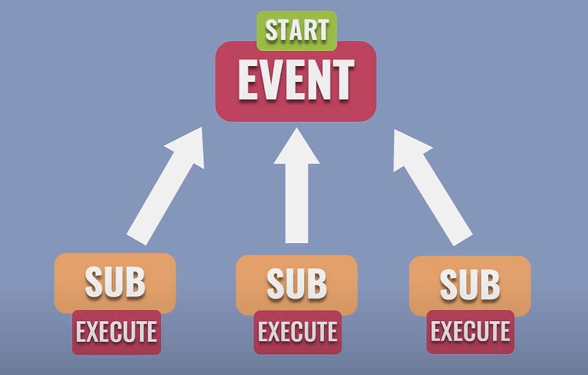
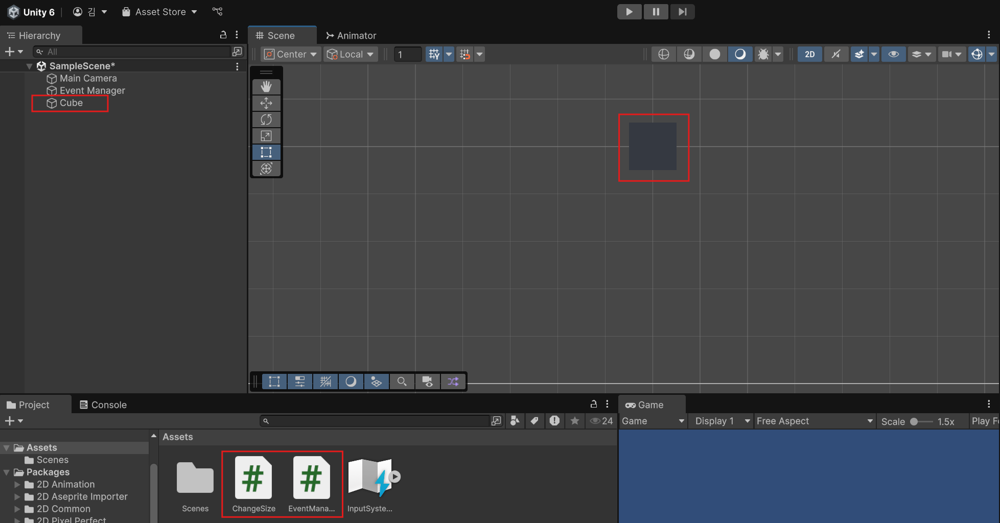

# 이벤트에 대하여 (2025-05-17)
## event란?
- even 는, 연쇄 동작을 이끌어내는 사건으로, 이벤트 자체는 어떤 일을 실행하지 않지만, 이벤트가 발생하면, 이벤트를 구독하는 처리들이 연쇄적으로 실행된다.

- 그림을 보면, Event가 실행되면, 해당 Event를 구독하고 있던 모든 SUB들이 실행되는 것을 볼 수 있다.
- 이런 `Event`를 사용하면, 어떤 클래스에서 `특정 사건이 일어났을 때`, 다른 클래스에서 `그것을 감지`하고 `관련된 처리를 실행`할 수 있다.
- 백문이 불여일견. 실습하면서 이해해보자.

``` C#
using UnityEngine;
using System; // 이거 추가해야됨!
using JetBrains.Annotations;

public class EventManager : MonoBehaviour
{
    public static event Action ExampleEvent; // 어디에서나 접근 가능하게 public static으로 선언

    private void Update()
    {
        if (Input.GetMouseButtonDown(0))
        {
            if (ExampleEvent != null) ExampleEvent();
        }
    }
}
```
- 이벤트를 사용하기에 앞서, `using System;`으로 네임스페이스 정의부터 진행해야 한다.
- 언제나 마우스 왼쪽 버튼을 누를 때, 이벤트가 발생하도록 코드를 작성하였다.
---
- 이후, 저 이벤트를 받을 GameObject를 하나 만들어보자.

- 필자는 큐브 오브젝트 하나와 이벤트를 받고 사이즈를 증가시킬 스크립트 ChangeSize 스크립트를 만들어 큐브 오브젝트의 컴포넌트에 적용시켰다.
```C#
// 크기 변경 스크립트
using UnityEngine;

public class ChangeSize : MonoBehaviour
{
    // Start is called once before the first execution of Update after the MonoBehaviour is created
    void Start()
    {
        EventManager.ExampleEvent += IncreaseSize;
    }
    
    private void IncreaseSize()
    {
        transform.localScale = new Vector3(2, 2, 2);
    }

    private void OnDisable() 
    {
        EventManager.ExampleEvent -= IncreaseSize;
    }
}
```
- 위에서 제작한 `ExampleEvent` 이벤트에 `IncreaseSize` 메서드를 등록시켰다. 이를 구독했다고도 이야기 한다.
- 저장하고 실행시켜 테스트해보자.
.gif)
- 왼클릭을 눌렀을 시, 박스의 사이즈가 증가하게 된다.
```
1. 즉, Example Script C# 파일에 작성된, ExampleEvent에 
2. 등록된 Change Size C# 파일에 만들어진 IncreaseSize가 등록되어서, +=
3. 마우스 오른쪽 버튼을 클릭할 시, ExampleEvent에 등록된 모든 메서드가 실행되어
4. IncreaseSize가 실행되어 `transform.localScale = new Vector3(2, 2, 2)` 가 작동된다.
5. 마지막으로, 큐브 오브젝트가 삭제될 시, ChangeSize C# 파일 속, OnDisable이 작동하여
6. ExampleEvent 에 등록된 IncreaseSize 메서드가 삭제된다. -=
```
