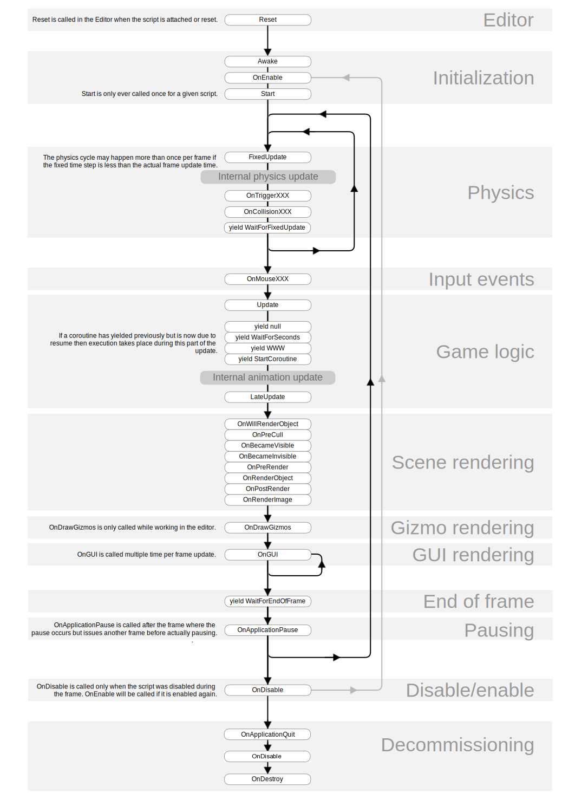

# event 호출 함수에 대하여 (2025-05-15)
# 이벤트 함수 실행 순서(Execution Order of Event Functions)
- Unity 이벤트 함수는 사전에 정해진 순서대로 실행된다. 실행 순서는 다음과 같다.
- 출처 : [유니티 공식문서](.https://docs.unity3d.com/kr/530/Manual/ExecutionOrder.html)
- 감사합니다, 유니티 공식문서. `제 시간을 아껴주셨습니다.`

## 에디터
- `Reset`: 오브젝트에 처음 연결하거나 Reset 커맨드를 사용할 때 스크립트의 프로퍼티를 초기화하기 위해 Reset을 호출한다.
---
### 첫 번째 씬 로드
- 다음 함수는 `씬이 시작할 때(씬에서 오브젝트마다 한 번) 호출`된다.

- `Awake` = 이 함수는 항상 Start 함수 전에 호출되며 프리팹이 인스턴스화 된 직후에 호출된다. 게임 오브젝트가 시작하는 동안 비활성 상태인 경우 `Awake 함수`는 활성화될 때까지 호출되지 않는다.
- `OnEnable(오브젝트가 활성화된 경우에만)` : `오브젝트 활성화 직후` 이 함수를 `호출`된다. 레벨이 로드되거나 스크립트 컴포넌트를 포함한 게임 오브젝트가 인스턴스화될 때와 같이 MonoBehaviour를 생성할 때 이렇게 할 수 있다.
- `OnLevelWasLoaded`: 이 함수는 세 레벨이 로드된 게임을 통지하기 위해 실행된다.

씬에 추가된 모든 오브젝트에 대해 Start, Update 등 `이전에 호출된 모든 스크립트`를 위한 `Awake 및 OnEnable 함수가 호출`된다. 원래 오브젝트가 게임플레이 도중 인스턴스화될 때 실행되지 않는다.

---
### 첫 번째 프레임 업데이트 전에
- `Start`: `스크립트 인스턴스가 활성화된 경우`에만 `첫 번째 프레임 업데이트 전에 호출`된다.

씬에 추가된 모든 오브젝트에 대해 Update 등 이전에 호출된 모든 스크립트를 위한 Start 함수가 호출된다. 원래 오브젝트가 게임플레이 도중 인스턴스화될 때 실행되지 않는다.

---
### 프레임 사이
- `OnApplicationPause`: 이 함수는 일시 정지가 감지된 프레임의 끝, 실질적으로는 일반 프레임 업데이트 사이에 호출된다. 게임에 일시정지 상태를 가리키는 그래픽스를 표시하도록 OnApplicationPause 가 호출된 후에 한 프레임이 추가로 실행된다.
---
### 업데이트 순서 : 프레임이 변경될 때?
게임 로직, 상호작용, 애니메이션, 카메라 포지션의 트랙을 유지할 때, 사용 가능한 몇몇 다른 이벤트가 존재한다. `일반적인 패턴은 Update 함수에 대부분의 작업을 수행하는 것`이지만, `사용할 수 있는 다른 함수도 있다`.

- `FixedUpdate`: FixedUpdate 는 종종 Update 보다 더 자주 호출된다. 프레임 속도가 낮은 경우 프레임당 여러 번 호출될 수 있으며 프레임 속도가 높은 경우 프레임 사이에 호출되지 않을 수 있다. 모든 물리 계산 및 업데이트는 FixedUpdate 후 즉시 발생한다. `FixedUpdate 의 움직임 계산을 적용할 때` `Time.deltaTime 만큼 값을 곱할 필요가 없다.` `FixedUpdate` 가 `프레임 속도와 관계없이` 신뢰할 수있는 `타이머에서 호출`되기 때문이다.

- `Update`: Update 는 `프레임당 한 번 호출`된다. 프레임 업데이트를 위한 주요 작업 함수이다.

- `LateUpdate` : LateUpdate 는 `Update 가 끝난 후 프레임당 한 번` 호출된다. `Update 에서 수행된 모든 계산`은 `LateUpdate 가 시작할 때 완료`된다. LateUpdate 는 일반적으로 다음의 3인칭 카메라에 사용한다. 캐릭터를 움직이고 Update 로 방향을 바꾸게 하는 경우 LateUpdate 에서 모든 카메라 움직임과 로테이션 계산을 수행할 수 있다. 이렇게 하면 카메라가 포지션을 추적하기 전에 캐릭터가 완전히 움직였는지 확인할 수 있다.
---
### 렌더링
- `OnPreCull`: 카메라가 씬을 컬링하기 전에 호출된다. 컬링은 어떤 오브젝트를 카메라에 표시할지 결정합니다. OnPreCull은 컬링 발생 직전에 호출된다.
- `OnBecameVisible`/`OnBecameInvisible`: 오브젝트가 카메라에 표시되거나/표시되지 않을 때 호출된다.
- OnWillRenderObject: 오브젝트가 표시되면 각 카메라에 한 번 호출된다.
- OnPreRender: 카메라가 씬 렌더링을 시작하기 전에 호출된다.
- OnRenderObject: 모든 일반 씬 렌더링이 처리된 후 호출된다. 이 때 커스텀 지오메트리를 그리는 데에 GL 클래스 또는 Graphics.DrawMeshNow를 사용할 수 있다.
- `OnPostRender`: 카메라가 씬 렌더링을 마친 후 호출된다.
- `OnRenderImage`: 이미지 후처리를 위해 씬 렌더링을 마친 후 호출된다.
- OnGUI: GUI 이벤트에 따라 프레임당 여러 번 호출됩니다. 레이아웃 및 리페인트 이벤트는 우선 처리되며 각 입력 이벤트에 대해 레이아웃 및 키보드/마우스 이벤트가 다음으로 처리된다.
- OnDrawGizmos: 시각화 목적으로 씬 뷰에 기즈모를 그릴 때 사용된다.
---
### 코루틴 : IEnumerator 사용
일반적인 코루틴 업데이트는 Update 함수가 반환된 후 실행됩니다. 코루틴은 주어진 YieldInstruction이 완료될 때까지 실행을 중단(양보)할 수 있는 함수입니다. 코루틴의 다른 사용법은 다음과 같다.

- yield 코루틴은 모든 Update 함수가 다음 프레임에 호출된 후 계속된다.
- yield WaitForSeconds : 지정한 시간이 지난 후, 모든 Update 함수가 프레임에 호출된 후 계속된다.
- yield WaitForFixedUpdate : 모든 FixedUpdate가 모든 스크립트에 호출된 후 계속된다.
- yield WWW :  WWW 다운로드가 완료된 후 계속된다.
- yield StartCoroutine : 코루틴을 연결하고 MyFunc 코루틴이 먼저 완료되기를 기다린다.
---
### 오브젝트를 파괴할 때
- `OnDestroy`: 오브젝트 존재의 마지막 프레임에 대해 모든 프레임 업데이트를 마친 후 이 함수가 호출된다. `오브젝트`는 `Object.Destroy` 또는 `씬 종료에 대한 응답`으로 `파괴될 수 있다`.
---
### 종료 시
다음 함수는 `씬의 활성화된 모든 오브젝트에서 호출`된다.

- `OnApplicationQuit`: `어플리케이션이 종료되기 전`에 `모든 게임 객체에서 호출`된다. `Editor`에서는 사용자가 `플레이 모드를 종료할 때 실행`된다. `웹 플레이어`에서는 `웹을 종료할 때 실행`된다.
- `OnDisable`: 동작이 비활성화되거나 비활성 상태일 때 이 함수가 호출된다.
---
### 스크립트 수명 주기 플로우차트
다음 다이어그램은 스크립트의 수명 동안 이벤트 함수의 호출 순서에 대한 요약입니다.

