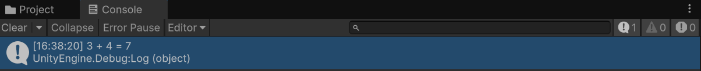

# C# 문법 : 함수(메서드) (2025-05-15)
## 1. 함수(메서드)란?
- 미리 정해진 동작을 수행하는 코드 묶음이다.
- 함수(메서드)를 사용하여, 코드 상에서 중복되는 기능을 수행하는 코드를 여러 번 작성하지 않게 도와준다.
``` C#
void Start()
{
    // 파이어볼 사용
    // mp 5감소
    // 파이어볼 발사
    // 효과음 발생

    // 파이어볼 사용
    // mp 5감소
    // 파이어볼 발사
    // 효과음 발생

    // 파이어볼 사용
    // mp 5감소
    // 파이어볼 발사
    // 효과음 발생
}
```
- 파이어볼을 세번 사용하는 기능을 구현한다고 할 때, Start 함수에 이런 이런식으로 작성하는 것은
- 코드의 가독성을 저하시키며, 기능 수정에 엄청 불편해진다.
---
- 중복적인 기능을 수행할 수 있는 함수(메서드)를 새로 만들자.
``` C#
void Start()
{
    fireball();
    fireball();
    fireball();
}

void fireball()
{
    // 파이어볼 사용
    // mp 5감소
    // 파이어볼 발사
    // 효과음 발생
}
```
- 파이어볼을 발사하는 함수(메서드) `fireball()`을 만들었다.
- 이후, `Start()` 함수(메서드)에서 `fireball();`를 세번 사용하여, 파이어볼을 세번 발사하게 구현하였다.

## 2. 함수(메서드)의 매개변수
- 함수(메서드)에 매개변수를 전달하여, 함수에서 값을 받아 기능을 동작하고 다시 기능을 반환하게 만들 수 있다.
``` C#
    void Start()
    {
        int mp = 100;
        fireball(ref mp);
        fireball(ref mp);
        fireball(ref mp);
    }

    void fireball(ref int mp)
    {
        Debug.Log("파이어볼 발사");
        Debug.Log("10mp 소모");
        mp = mp - 10;
        Debug.Log("현재 mp : " + mp);
    }
```
- 간단하게, fireball함수를 호출하면, mp 변수의 값이 깎이는 함수를 구현하였다.
- 결과 화면은 다음과 같다.

- fireball 함수가 세 번 사용되어, mp 변수가 10씩 깎이는 걸 볼 수가 있다.
- 레퍼런스 변수를 사용해서 함수로 전달한 mp 변수가 변하면(mp = mp - 10;) Start() 함수에서도 mp 변수의 값이 바뀌게 코드를 구성하였다.

## 3. 함수(메서드)의 값 반환
``` C#
    int a = 3;
    int b = 4;
    int c;
    void Start()
    {
        c = Plus(a, b);
        Debug.Log(a + " + " + b + " = " + c);
    }
    
    int Plus(int a, int b)
    {
        c = a + b;
        return c;
    }
```

- `Plus 함수의 자료형을 int`로 설정 + `return c;` 를 통하여, Plus 함수 수행시 나오는 `c 변수의 값`을 함수를 호출한 `Start 함수로 전달`하게 됨.
- 따라서, Start 함수 속 `변수 c에 7 값이 저장`됨.