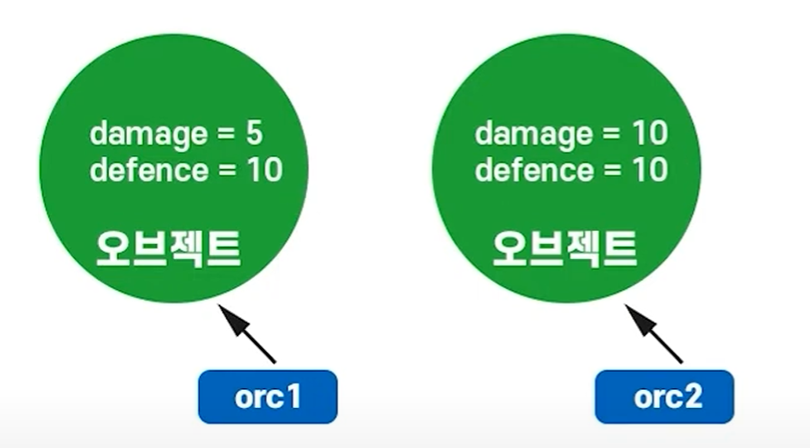
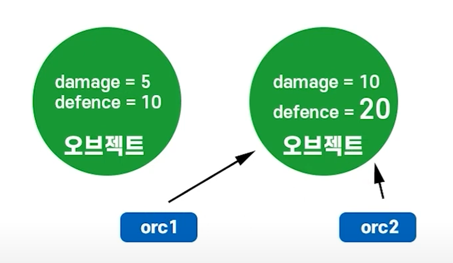

# C# 문법 : 클래스 (2025-05-15)
## 1. 클래스란?
- `만들 대상과 관련된 함수와 변수들의 묶음을 의미`한다.
- 게임에서 몬스터를 만든다고 생각해보자.
``` C#
class monster
{
    void IDLE() { } // 대기 기능
    void move() { } // 이동 기능
    void attack() { } // 공격 기능
    void die() { } // 죽음 기능
}
```
- monster 이름의 클래스는, 다음과 같은 함수들을 가지고 있다.
- 이제, 이 monster 클래스의 기능들을 가지는 Orc 몬스터를 만들어보자면
``` C#
class orc : monster
{
    // monster 클래스의 모든 기능들 사용 가능
    void Special_attack() { } // 오크만의 특수 기술 기능
}
```
- 이렇게 `오크 몬스터의 기능`을 가지는 `orc 클래스`를 만들었다.
- orc 클래스는, monster 클래스를 상속받아서 만들어진 자식 클래스이다.
- 즉, `monster = 부모 클래스`이며, `orc = 자식 클래스`인 `상속받은 관계`가 나타난다.
- `orc 클래스`는 `Special_attack() 이라는 함수`를 가지는 동시에, `monster 클래스의 4가지 함수의 기능`도 가지게 된다.
- 즉, 자식 클래스는 상속 받은 부모 클래스의 기능을 모두 가지게 된다.
---
- 그렇다고 상속이 무조건 좋은거냐? 라면 그건 또 아니다.
- orc 클래스를 상속받는 `orcNPC`를 만든다고 생각해보자.
``` C#
class orcNPC : orc
{
    // 이동 기능 삭제
    // 공격 기능 삭제
    // 죽음 기능 삭제
    // 오크 특수 기술 삭제
}
```
- 클래스를 만들고 보니, `orcNPC가 갖지 말아야할 이동 기능, 공격 기능, 죽음 기능들`이 `상속`으로 인하여 기능을 갖게 된다.
- 이 orcNPC를 게임에서 사용하기 위해서는, // 처리된것 처럼, `필요없는 기능들을 다 지워줘야 되는 불상사`가 발생한다.
- `상속은 만능이 아니다`라는 점을 기억해두도록 하자.
---
- 상속을 이용한 코드를 구성해보았다.
``` C#
public class NewMonoBehaviourScript : MonoBehaviour
{
    // Start is called once before the first execution of Update after the MonoBehaviour is created
    void Start()
    {
        Orc orc = new Orc();
        orc.Ready();
        orc.Move();
    }


}
public class monster
{
    public void IDLE()
    {
        Debug.Log("idle");
    }
    public void move()
    {
        Debug.Log("Move");
    }
}

public class Orc : monster
{
    public void Ready()
    {
        base.IDLE();
    }
    public void Move()
    {
        base.move();
    }
}
```

- Orc 클래스로 만든 orc 변수에서 Ready(), Move()를 사용하였다.
- 이때, `base.IDLE()`와 `base.move()`가 각각 실행되어, `monster 클래스`의 `IDLE()함수와 move() 함수가 실행`되었다.
- 자식 클래스는, 부모 클래스의 함수를 사용할 수 있다는 점을 알고 넘어가자.

## 2. 클래스는 참조타입이다.
- `참조 타입` = 값(실체)으로 향하는 `참조를 저장`
- `값 타입` = 해당 변수 공간에 `값 자체를 저장`하는 것

|참조 타입|값 타입|
|------|---|
|class 타입|C# 내장 변수(자료형)|
|유니티의 모든 컴포넌트|struct(구조체 타입)|
|우리가 작성할 C# 스크립트(MonoBehaviour를 상속받는 클래스)|
---

``` C#
int gold; // 변수가 생성됨(int는 값타입)
Orc orc1; // 변수가 생성되지 않음(클래스는 참조타입)
Orc orc2 = new Orc(); // Orc 오브젝트를 가리키는 변수 orc2를 만듬.
```
- `클래스`는 `참조타입`이기 때문에, 클래스 변수를 만들 때, 선언 뒤에 `new 키워드를 통해 오브젝트를 가리키게 된다`.
``` C#
public class NewMonoBehaviourScript : MonoBehaviour
{
    // Start is called once before the first execution of Update after the MonoBehaviour is created
    void Start()
    {
        Orc orc1 = new Orc();
        Orc orc2 = new Orc();

        orc1.damage = 5;
        orc2.damage = 10;
    }
}

public class Orc
{
    public int damage;
    public int defence = 10;
}
```
- 위 코드를 도식화 해보면

- 이런 그림이 나오게 된다.
- 이때, 코드를 다음과 같이 변경해본다면?
``` C#
public class NewMonoBehaviourScript : MonoBehaviour
{
    // Start is called once before the first execution of Update after the MonoBehaviour is created
    void Start()
    {
        Orc orc1 = new Orc();
        Orc orc2 = new Orc();

        orc1.damage = 5;
        orc2.damage = 10;

        orc1 = orc2;
        orc1.defence = 20;
    }
}
```
- `orc1 = orc2;`와 `orc1.defence = 20;` 를 작성하였다.
- 이렇게 되면, `orc1이 가리키는 오브젝트`가 `orc2가 가리키는 오브젝트`로 변하게 되어
- `orc1.defence = 20; 이 실행`되면, `orc2가 가리키던 오브젝트의 defence 값이 20으로 변하게 된다`.

- 이렇게 사용되게 된다.
### 클래스로 만든 변수는 값을 저장한 변수가 아닌, 오브젝트를 가리키는 참조값으로 생성이 된다.

## 3. 멤버와 접근제한자
- 멤버와 접근제한자에 대해서 알기 전, 이전에 만든 `monster 클래스`를 다시 가져와보자.
``` C#
public class monster
{
    public void IDLE()
    {
        Debug.Log("idle");
    }
    public void move()
    {
        Debug.Log("Move");
    }
    public int exp;
}
```
- `클래스의 멤버` = 클래스에 속하며, `해당 클래스의 데이터와 행위를 표현하는 요소들`
- 즉, `monster 클래스에 속한 IDLE(), move() 함수(메서드) 가 클래스의 멤버`이다.
- 여기서, 클래스 속 `변수인 exp`는 특별히 `클래스의 필드`라고 불린다.
---
- `접근제한자`에 대해서 알아보도록 하자.
- `접근 제한자` = `클래스 멤버의 공개 여부를 정하는 키워드`이다. 
1. `public` : 클래스 `외부에서 멤버에 접근 가능`
2. `private` : 클래스 `내부에서만 멤버에 접근 가능`
3. `protected` : `클래스 내부와 파생 클래스에서만 멤버에 접근 가능`

## 4. `MonoBehaviour`는 `new를 사용하지 않는다`.
- 작성하는 스크립트 대부분은 `MonoBehaviour 클래스를 상속`한다.
- `MonoBehaviour를 상속한 클래스`는 유니티 창에서 드래그&드롭 등으로 `스크립트를 게임 오브젝트에 컴포넌트로 추가하는 방법`으로만 `오브젝트`로 만들 수 있다.
- `MonoBehaviour를 상속한 클래스`는 `컴포넌트로 동작`하며, `컴포넌트는 게임 오브젝트의 부품`으로만 존재할 수 있다.
- 따라서, 만든 `스크립트를 저장`한 후, `하이어러키 창에 만들어진 게임 오브젝트`에 `컴포넌트로 추가`하면서, `게임 오브젝트가 게임에서 기능을 수행`할 수 있게 만들어준다!