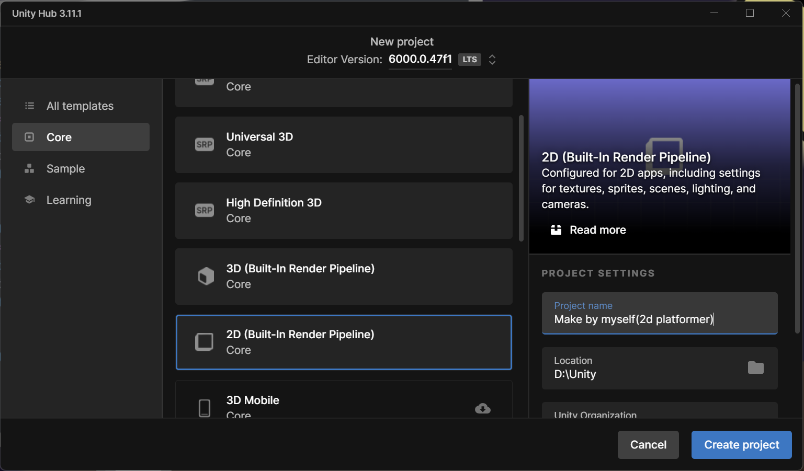
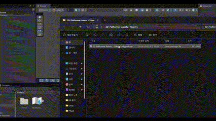
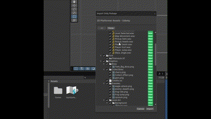
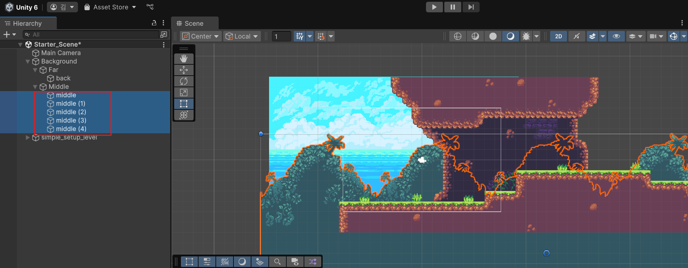
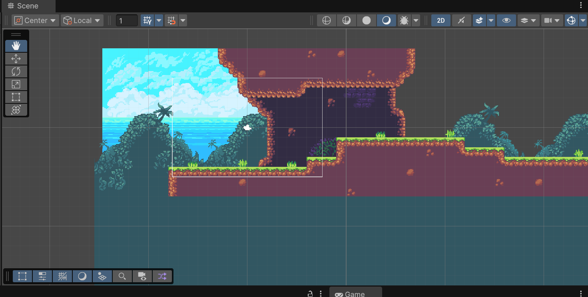

# Chapter. 1 기본 설정하기 (Getting started)
## 유니티 프로젝트 만들기

- 2D 플랫포머 게임을 만들기 위해서, 2D로 프로젝트를 만들자.

## 에셋 다운하기.

- 다운 받은 zip 폴더를 압축 풀고, 폴더 속 `unitypackage` 파일을 유니티 창에 끌어온다.

- 이후, 모든 에셋을 다 선택하고, `Import` 버튼을 클릭한다.

- 새로 생긴 `2D Platformer Assets` 폴더를 들어가보면, 에셋들이 엄청 생겨있다.

## 가장 기본 만들기
- 가장 먼저, 씬을 만들어보자.

- 에셋 파일 중, `Starter_Scene (Scene Asset)` 을 더블 클릭하여 씬을 연다.
- 근데, 씬을 열면 뭔가 이상해보일 것이다.
- 이 화면을 정돈시킬 것이다.
---
---

- 가장 먼저, 푸른색 배경인 `back` 스프라이트를 가장 뒤쪽으로 보내는 작업을 하겠다.
- `하이어러키` 창에서 `back` 스프라이트를 선택한다.
- `Inspector` 창에 `Sprite Renderer` 속 `Order in Layer` 값으로 정한다.
- 배경이 될 `back` 은 가장 뒤로 가야되니 `-2` 로 설정한다.

- 완성된 화면이다. `배경`이 깔끔하게 `뒤`로 보내졌고, `앞에 수풀과 플랫폼`이 앞으로 오게되었다.

- `수풀 스프라이트`는 `배경 보다는 앞`에, `플랫폼 보다는 뒤`로 설정해야 한다.
- 앞에서 한 방법처럼, `Order in Layer` 값을 `-1`로 설정한다.
---
---
### 완성본

- 우리가 작업할 `씬`이 완성되었다.
- 2강에서는 `캐릭터`를 작업해보겠다.