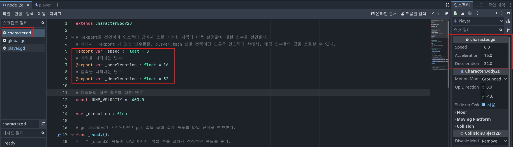
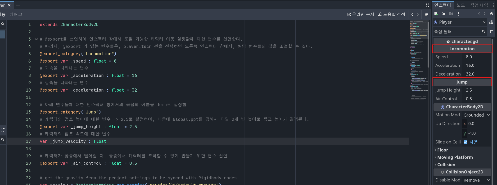
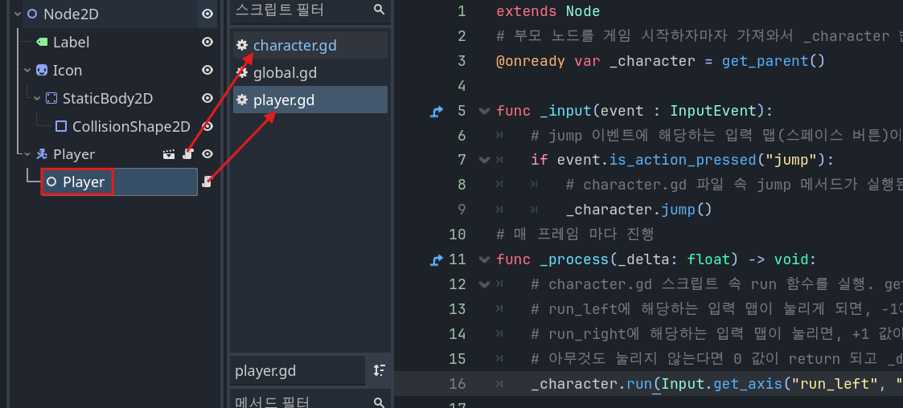

# 캐릭터 이동 구현하기 (2025-05-20 ~ )
> ## 바로가기
> [1. 캐릭터를 타일 단위로 이동하게 구현하기 global.gd](#1-globalgd-스크립트-파일로-픽셀-단위를-곱해서-캐릭터를-타일-단위로-이동하게-구현하기)<br>
> [2. 캐릭터의 뼈대 구현하기 character.gd](#2-이제-캐릭터의-기본적인-뼈대를-구현해봅시다)<br>
> [3. 플레이어의 입력 처리하기 player.gd](#3-플레이어의-입력을-처리하는-playergd-스크립트-파일-만들기)
## 1. Global.gd 스크립트 파일로, 픽셀 단위를 곱해서 캐릭터를 타일 단위로 이동하게 구현하기
### <span style="background-color:#E6E6FA; color : black; font-weight : bold;">캐릭터 속도를 구현할 때 왜 픽셀 단위를 신경써야 되나요?</span>
- 우리가 캐릭터를 이동 시킬때는 속도 변수를 구현하고, 이를 토대로 캐릭터의 velocity 에 변수를 곱하거나 막 하는 식으로 구현한다.
- 고도 엔진의 <span style="background-color:#fff5b1; color : black; font-weight : bold;">2D 게임</span>에서 `기본 단위`는 `'픽셀'`이다.
- 그런데, 게임 타일맵을 살펴보면, `타일 하나당 픽셀`이 `32 X 32` 이거나, `64 x 64` 등등 여러 가지 형식의 픽셀 단위가 존재한다.
- 우리가 조작할 캐릭터가 픽셀 단위로 움직이는 거가 속도를 구성하기 편할까
- 아니면, `타일 단위로 움직이게 속도를 구현하는 것이 편할까?`
- 우리는 속도에 타일 하나당의 픽셀 값을 곱해서, `캐릭터의 속도가 한 타일당 움직이도록 구현하는 디자인 패턴`을 사용해볼 것이다.

### 그러면, 구현해봅시다!
``` GDScript
# global.gd 스크립트 파일 내부 속
extends Node

# 전체 프로젝트에서 사용할 변수를 저장한 global.gd 스크립트 파일
# 이 스크립트 파일은, 프로젝트 설정에서 Global 항목 속에서 전역 변수로 사용될 것임.
# 즉, 게임이 시작되면 자동으로 선언될 전역 변수임
# ppt 변수는 Pixel per tile 뜻으로, 현재 게임 에셋은 타일 하나가 32 x 32 픽셀 사이즈로 구성되어 있다.
# 우리는 캐릭터가 한 타일당 움직이는 속도로 구성하고 싶다. 그러는게 더 편하다.
# 따라서, 전역 변수 ppt의 속성으로 32값을 넣었다.
# 만약, 타일이 64 X 64 픽셀이라면? 64 값을 넣으면 된다.
var ppt : int = 32

```
- 위 코드 속 int 자료형 변수 `ppt` 가 바로 `타일 하나당 픽셀의 개수를 저장할 변수`이다.
- 우리가 제작하는 2D 픽셀 플랫포머 게임의 `타일 하나당 픽셀의 개수는 32개` 이다. 즉 `32 X 32 픽셀의 타일`로 구성되어있다.
- 따라서, `ppt` 변수에 `32` 값을 넣는다.<br>
> .gif)
> 1. 고도 엔진 프로그램 왼쪽 상단 `프로젝트` 버튼을 누른다.
> 2. `프로젝트 설정`을 누른다.
> 3. `Globals` 버튼을 누른다.
> 4. `경로 :` 부분에서 global.gd 스크립트 파일을 찾고 `+추가` 버튼을 클릭한다.
> 5.  전역변수 활성화 체크 박스가 체크 되어있는지 확인하고 창을 닫는다.
- 이후, 위 gif 파일의 작업을 통해서, global.gd 스크립트 파일을 전역 변수로 설정해놓는다.
- 위 작업을 통해, `Global.gd` 스크립트 파일 속, `ppt` 변수를 어디에서 사용할 수 있게 된다.

## 2. 이제, 캐릭터의 기본적인 뼈대를 구현해봅시다.
- 뼈대라고 한다면, 게임 속 캐릭터들이 모두 다 이 코드를 사용할 수 있도록 코드를 짜자는 이야기이다.
- 플레이어 캐릭터, 적 캐릭터1, 적 캐릭터2.... 등등 각각에 해당하는 픽셀 단위당의 이동과 점프에 대한 뼈대를 하나씩 만들게 되면, 굉장히 귀찮은 작업이 될 것이다.
- 따라서, 다음 기능들에 대한 뼈대인 character.gd 스크립트 파일을 만들고,
- 캐릭터들에 스크립트 파일을 넣는 식으로 구현하면 편할것이다.
> 1. 캐릭터의 속도, 가속, 감속 에 대한 값을 인스펙터 창에서 구현하도록 변수 선언
> 2. 캐릭터의 점프 높이와 속도에 대한 변수
> 3. 게임 시작시, 속도, 가속, 감속에 대한 값을 픽셀 단위에서 타일 단위로 변환
> 4. 플레이어 캐릭터 한정, 입력에 대한 방향 이동과 점프를 구현한 메서드
> 5. 매 프레임마다 캐릭터의 중력과 이동을 처리하는 메서드
>
- 정리해보니 기능이 엄청 많다. ㅋㅋㅋㅋㅋ
- 전체 코드를 아래에다가 작성해두겠다.
```GDScript
extends CharacterBody2D

# @export를 선언하여 인스펙터 창에서 조절 가능한 캐릭터 이동 설정값에 대한 변수를 선언한다.
# 따라서, @export 가 있는 변수들은, player.tscn 씬을 선택하면 오른쪽 인스펙터 창에서, 해당 변수들의 값을 조절할 수 있다.
@export_category("Locomotion")
@export var _speed : float = 8
# 가속을 나타내는 변수
@export var _acceleration : float = 16
# 감속을 나타내는 변수
@export var _deceleration : float = 32

# 아래 변수들에 대한 인스펙터 창에서의 묶음의 이름을 Jump로 설정함
@export_category("Jump")
# 캐릭터의 점프 높이에 대한 변수 => 2.5로 설정하여, 나중에 Global.ppt를 곱해서 타일 2개 반 높이로 점프 높이가 결정된다.
@export var _jump_height : float = 2.5
# 캐릭터의 점프 속도에 대한 변수
var _jump_velocity : float

# 캐릭터가 공중에서 떨어질 때, 공중에서 캐릭터를 조작할 수 있게 만들기 위한 변수 선언
@export var _air_control : float = 0.5

# get the gravity from the project settings to be synced with Rigidbody nodes
var gravity = ProjectSettings.get_setting("physics/2d/default_gravity")

# gd 스크립트가 시작된다면? ppt 값을 곱해 실제 속도를 타일 단위로 변환한다.
func _ready():
	# _speed의 속도에 타일 하나당 픽셀 수를 곱해서 정상적인 속도를 준다.
	_speed *= Global.ppt
	# _acceleration의 속도에 타일 하나당 픽셀 수를 곱해서 정상적인 속도를 준다.
	_acceleration *= Global.ppt
	# _deceleration의 속도에 타일 하나당 픽셀 수를 곱해서 정상적인 속도를 준다.
	_deceleration *= Global.ppt
	# _jump_height의 속도에 타일 하나당 픽셀 수를 곱해서 정상적인 속도를 준다.
	_jump_height *= Global.ppt
	# 캐릭터의 점프 속도를 _jump_height * gravity * 2의 값을 루트한 값에 -1을 곱한 값으로 저장한다.
	_jump_velocity = sqrt(_jump_height * gravity * 2) * -1

var _direction : float

#region Public Methods

func face_left():
	pass
func face_right():
	pass

# 플레이어 입력에서 전달된 방향 (-1, 0, 1)을 _direction 에 저장한다.
func run(direction : float):
	# run 메서드로부터 받아온 direction 값을 _direction 값에 대입
	_direction = direction

func jump():
	# 캐릭터가 바닥에 있다면?
	if is_on_floor():
		# Y축 좌표로 _jump_velocity 만큼 속도를 준다. == 점프하게 한다.
		velocity.y = _jump_velocity
		
# 플레이어가 점프 버튼을 때었을 때, 캐릭터가 내려오게 만드는 기능
func stop_jump():
	if velocity.y < 0:
		velocity.y = 0
#endregion

# 매 프레임마다 중력/이동을 처리한다.
func _physics_process(delta: float) -> void:
	# 캐릭터가 바닥에 있다면?
	if is_on_floor():
		# _ground_physics = 지상 물리학 메서드로 실행한다.
		_ground_physics(delta)
	# 캐릭터가 공중에 있다면?
	else:
		# _air_physics = 공중 물리학 메서드로 실행한다.
		_air_physics(delta)
	# _physics_process 사용시 추가해야 될 코드 == 충돌 고려하여 이동을 처리한다.
	move_and_slide()
	
# 지상 물리학 메서드
func _ground_physics(delta : float):
	# return 해서 받아온 _direction 값이 0이라면? (이동처리)
	# 즉, 0으로 감소한다면
	if _direction == 0:
		# x축의 속도(velocity.x)를 = velocity.x(현재 값)값으로부터 0(목표값)까지 한번에 _deceleration * delta 값의 속도로 갈수 있다.
		# 즉, x축의 속도를 0으로 만들어버려 캐릭터의 움직임을 막는다.
		velocity.x = move_toward(velocity.x, 0, _deceleration * delta)
	# x 축 속도가 0이거나 _direction의 방향이 velocity.x의 방향과 동일하다면?
	# 즉, 움직이지 않았던 상태에서 가속하거나 || 같은 방향으로 계속 움직일러 한다면?
	elif velocity.x == 0 || sign(_direction) == sign(velocity.x):
		# 오른쪽, 또는 왼쪽을 결정하는 _direction 값 * _speed의 값으로 velocity.x 의 값을 _acceleration * delta 값의 속도로 이동한다.
		velocity.x = move_toward(velocity.x, _direction * _speed, _acceleration * delta)
	# 만약 반대 방향으로 이동할러고 한다면, 감속시킨다.
	else:
		velocity.x = move_toward(velocity.x, _direction * _speed, _deceleration * delta)
	
# 항공 물리학 메서드
func _air_physics(delta : float):
	# y축에 + 방향으로 중력을 줘서 캐릭터를 아래로 떨어뜨린다.
	velocity += get_gravity() * delta
	# 만약 방향이 0이 아니라면 = 플레이어가 공중에서 캐릭터를 좌우로 움직인다면?
	if _direction:
		# x 축의 속도를 공중에서 제어를 할수는 있지만, _air_control(0.5)를 곱해서 절반정도의 속도로 조절하게 만든다. = 플레이어가 공중에서 약간의 좌우 이동을 가능하게 만듬.
		velocity.x = move_toward(velocity.x, _direction * _speed, _acceleration * _air_control * delta)
```
- 이곳에서 보기 힘들다면, 코드를 복사한 후, GDScript 에서 확인하면 될 것같다.
- 차근차근 살펴봅시다. 할 수 있다! :)
### 2-1. 캐릭터의 속도, 가속, 감속에 대한 값을 인스펙터 창에서 설정할 수 있게 하기
```GDScript
# @export를 선언하여 인스펙터 창에서 조절 가능한 캐릭터 이동 설정값에 대한 변수를 선언한다.
# 따라서, @export 가 있는 변수들은, player.tscn 씬을 선택하면 오른쪽 인스펙터 창에서, 해당 변수들의 값을 조절할 수 있다.
@export_category("Locomotion")
@export var _speed : float = 8
# 가속을 나타내는 변수
@export var _acceleration : float = 16
# 감속을 나타내는 변수
@export var _deceleration : float = 32

# 아래 변수들에 대한 인스펙터 창에서의 묶음의 이름을 Jump로 설정함
@export_category("Jump")
# 캐릭터의 점프 높이에 대한 변수 => 2.5로 설정하여, 나중에 Global.ppt를 곱해서 타일 2개 반 높이로 점프 높이가 결정된다.
@export var _jump_height : float = 2.5
# 캐릭터의 점프 속도에 대한 변수
var _jump_velocity : float

# 캐릭터가 공중에서 떨어질 때, 공중에서 캐릭터를 조작할 수 있게 만들기 위한 변수 선언
@export var _air_control : float = 0.5
```
- 위 부분이 바로 캐릭터의 속도, 가속, 감속에 대한 값을 인스펙터 창에서 설정할 수 있게 하는 코드이다.
- > 속도 == `_speed : float = 8` <br>
  > 가속 == `_acceleration : float = 16` <br>
  > 감속 == `_deceleration : float = 32` <br>
  > 점프 높이 == `_jump_height : float = 2.5` <br>
  > 공중 조작 == `_air_control : float = 0.5` <br>
- 위의 변수들이 바로 각각에 대한 값들을 담는 변수이다.
- 그리고, 코드를 살펴보면,
```GDScript
@export var _speed : float = 8
```
- 변수 선언 `var` 앞에 `@export`가 붙은 것을 확인할 수 있다.
- 이는, 이 변수를 인스펙터 창에서 값을 설정할 수 있게 만들어주는 키워드이다.
- 유니티의 public과 비슷한 개념으로 이해했다.<br>
<br>
- 빨간 네모 박스들 중 맨 오른쪽 인스펙터 창을 보면, 해당 변수들의 값을 조절할 수 있게 설정된 것을 볼 수 있다.
- 즉, `캐릭터들`마다 `각각의 속도, 가속, 감속, 점프 높이, 공중 조작`를 스크립트 파일 속이 아닌, 밖`(=인스펙터창)`에서도 설정할 수 있게 되었다. 만세!
- 또한, 맨 위에 `@export_category` 키워드를 사용하여서, 각 변수들의 칸 이름을 설정하였다.

<br>
- 인스펙터 창 속 빨간 네모박스에 이름이 설정된 것이 보이는가?
---
### 2-2. 캐릭터의 점프 속도와 점프 높이에 대한 변수
``` GDScript
# 캐릭터의 점프 높이에 대한 변수 => 2.5로 설정하여, 나중에 Global.ppt를 곱해서 타일 2개 반 높이로 점프 높이가 결정된다.
@export var _jump_height : float = 2.5
# 캐릭터의 점프 속도에 대한 변수
var _jump_velocity : float

# get the gravity from the project settings to be synced with Rigidbody nodes
var gravity = ProjectSettings.get_setting("physics/2d/default_gravity")
```
- 위에와 마찬가지로, 캐릭터의 `점프 높이`를 조절할 수 있게 설정하였다. `@export` 를 사용함.
- 또한, `_jump_height` 라는 변수에 2.5 값을 넣고, 2-3 에서 `타일 단위로 변환`하는 작업을 할 것이다.
- `_jump_velocity` 변수는, 캐릭터의 `점프 속도`에 대한 변수로, 아래 2-3 에서 값을 조절할 것이다.
---
### 2-3. 게임 시작시 속도, 가속, 감속에 대한 값을 픽셀 단위에서 타일 단위로 변환
``` GDScript
# gd 스크립트가 시작된다면? ppt 값을 곱해 실제 속도를 타일 단위로 변환한다.
func _ready():
	# _speed의 속도에 타일 하나당 픽셀 수를 곱해서 정상적인 속도를 준다.
	_speed *= Global.ppt
	# _acceleration의 속도에 타일 하나당 픽셀 수를 곱해서 정상적인 속도를 준다.
	_acceleration *= Global.ppt
	# _deceleration의 속도에 타일 하나당 픽셀 수를 곱해서 정상적인 속도를 준다.
	_deceleration *= Global.ppt
	# _jump_height의 속도에 타일 하나당 픽셀 수를 곱해서 정상적인 속도를 준다.
	_jump_height *= Global.ppt
	# 캐릭터의 점프 속도를 _jump_height * gravity * 2의 값을 루트한 값에 -1을 곱한 값으로 저장한다.
	_jump_velocity = sqrt(_jump_height * gravity * 2) * -1
```
- 캐릭터의 속도, 가속, 감속에 해당하는 `변수`에 `Global.ppt` 를 사용하여, `전역 변수 ppt`의 값을 `곱`해주었다.
- 따라서, 캐릭터는 이제 특별히 값을 조절하지 않는 한, `속도`는 `8 * 32` 의 값을 가지게 된다.
- 똑같은 방식으로 `가속, 감속`에도 `적용`이 된다.
- 또한, 캐릭터의 `점프 높이`도, 픽셀 단위가 아닌, `타일 단위로 조절`하여, `캐릭터가 점프하였을 시`, `타일 2개 반 정도의 높이`로 제한하게 된다.
- 또한, 캐릭터의 `점프 속도`를 `_jump_height * gravity * 2` 값의 `루트(sqrt)`한 값에 `-1`을 곱한 값으로 저장하여, `점프를 할 시, 해당 속도에 맞춰서 위로 점프하게 구현`한다.
- -1을 한 이유는, `고도 엔진`에서는, `Y축 위로 가는 것`이 `음수`이기 때문이다. 양수면은 Y축 아래로 향한다.

.gif)<br>
- 딱 위에 코드까지만 구성한 후, 작성해보면 캐릭터의 점프가 살짝 붕뜨는걸 볼 수 있다.
- 우리는 좀 더 현실적인 중력을 구현하기 위해, `프로젝트의 중력을 바꿀 것`이다.
> 1. 프로젝트 -> 프로젝트 설정
> 2. 물리 -> 2D
> 3. 기본 중력 -> 9.8 * 32 * 8<br>
> .gif)

.gif)<br>
- 조금 더 현실적으로, 캐릭터가 떨어지는 것을 볼 수 있다.
---
### 2-4. 입력에 대한 방향 이동과 점프를 구현한 메서드
``` GDScript
# character.gd 스크립트 파일에서 사용할 변수 선언
var _direction : float

# 퍼블릭 메서드로 코드들을 깔끔하게 묶어서 보기 편하게 설정함.
#region Public Methods
# 미구현
func face_left():
	pass
# 미구현
func face_right():
	pass

# 플레이어 입력에서 전달된 방향 (-1, 0, 1)을 _direction 에 저장한다.
func run(direction : float):
	# run 메서드로부터 받아온 direction 값을 _direction 값에 대입
	_direction = direction

func jump():
	# 캐릭터가 바닥에 있다면?
	if is_on_floor():
		# Y축 좌표로 _jump_velocity 만큼 속도를 준다. == 점프하게 한다.
		velocity.y = _jump_velocity
		
# 플레이어가 점프 버튼을 때었을 때, 캐릭터가 내려오게 만드는 기능
func stop_jump():
	if velocity.y < 0:
		velocity.y = 0
#endregion
```
- 코드 겁나 길구만 ㅋㅋㅋㅋ
> - 먼저, 우리가 플레이어 캐릭터를 조종할러면, 키보드나 조이스틱 같은 입력을 통해서 이동을 구현해야 한다.<br>
> - 따라서, 플레이어 캐릭터 가지는 이동은 player.gd 스크립트 파일을 따로 파서, 그곳에서 입력에 대한 코드를 작성할 것이다.<br>
> - 이렇게 플레이어 입력에 대한 코드를 따로 빼는 이유는, 이 character.gd 파일은 게임 속 등장하는 모든 캐릭터에 대한 뼈대를 제공하는 코드이기 때문이다.
- 다시 돌아와서, 코드를 하나씩 살펴보자.
#### `1. player.gd 파일에서 준 값을 저장할 변수 선언`
``` GDScript
# character.gd 스크립트 파일에서 사용할 변수 선언
var _direction : float
```
- 우리는 `입력`을 `다른 스크립트 파일` `player.gd` 에서 받아온다고 했었다.
- 입력을 우리는 숫자 `-1, 0, 1 과 같은 숫자`로 받을 것이다.
- 즉, `플레이어가 입력한 방향`에 따라 `player.gd` 파일이 `-1, 0, 1` 의 숫자를 전달하는 것이다.
- 그러니, `character.gd` 파일에서 이 `숫자들을 저장할 변수를 선언`한 것이다.

#### `2. 플레이어 캐릭터가 왼쪽, 오른쪽 방향을 보는 것을 처리하는 메서드`
미구현

#### `3. player.gd 파일에서 준 값을 변수에 저장`
``` GDScript
# 플레이어 입력에서 전달된 방향 (-1, 0, 1)을 _direction 에 저장한다.
func run(direction : float):
	# run 메서드로부터 받아온 direction 값을 _direction 값에 대입
	_direction = direction
```
- player.gd 스크립트 파일에서 사용할 run 메서드를 만든다.
- run 메서드는, player.gd 스크립트 파일에서 전달한 float 변수 값이 저장된 direction 변수를
- _direction 변수에다가 저장한다.
- 즉, `player.gd` 스크립트 파일에서 `전달한 값`을 `_direction` 변수에 `저장`하는 `메서드`이다.
- player.gd 스크립트에서 어떻게 character.gd 파일 속 run 메서드를 실행시켜요?
- `3단`에서 설명하니 기다려라.

#### 4. 플레이어 점프와 점프 버튼을 때었을 시 떨어지는 것 구현
``` GDScript
func jump():
	# 캐릭터가 바닥에 있다면?
	if is_on_floor():
		# Y축 좌표로 _jump_velocity 만큼 속도를 준다. == 점프하게 한다.
		velocity.y = _jump_velocity
		
# 플레이어가 점프 버튼을 때었을 때, 캐릭터가 내려오게 만드는 기능
func stop_jump():
	# y 축의 속도가 0보다 작다 => 캐릭터가 위로 점프하는 중이다.
	if velocity.y < 0:
		# y축의 속도를 0으로 만들어버린다. => 캐릭터가 아래로 추락하게 만든다.
		velocity.y = 0
```
- 위의 jump() 메서드와 stop_jump() 메서드는, player.gd 스크립트 파일에서 플레이어의 입력을 받아서 이 메서드들을 호출하는 식으로 구성된다.
- 해당 코드들은 간단한 코드이므로, 주석의 설명으로 대체하겠다.
---
---

### `2-5. 매 프레임마다 캐릭터의 중력과 이동을 처리하는 메서드`
``` GDScript
# 매 프레임마다 중력/이동을 처리한다.
func _physics_process(delta: float) -> void:
	# 캐릭터가 바닥에 있다면?
	if is_on_floor():
		# _ground_physics = 지상 물리학 메서드로 실행한다.
		_ground_physics(delta)
	# 캐릭터가 공중에 있다면?
	else:
		# _air_physics = 공중 물리학 메서드로 실행한다.
		_air_physics(delta)
	# _physics_process 사용시 추가해야 될 코드 == 충돌 고려하여 이동을 처리한다.
	move_and_slide()
	
# 지상 물리학 메서드
func _ground_physics(delta : float):
	# return 해서 받아온 _direction 값이 0이라면? (이동처리)
	# 즉, 0으로 감소한다면
	if _direction == 0:
		# x축의 속도(velocity.x)를 = velocity.x(현재 값)값으로부터 0(목표값)까지 한번에 _deceleration * delta 값의 속도로 갈수 있다.
		# 즉, x축의 속도를 0으로 만들어버려 캐릭터의 움직임을 막는다.
		velocity.x = move_toward(velocity.x, 0, _deceleration * delta)
	# x 축 속도가 0이거나 _direction의 방향이 velocity.x의 방향과 동일하다면?
	# 즉, 움직이지 않았던 상태에서 가속하거나 || 같은 방향으로 계속 움직일러 한다면?
	elif velocity.x == 0 || sign(_direction) == sign(velocity.x):
		# 오른쪽, 또는 왼쪽을 결정하는 _direction 값 * _speed의 값으로 velocity.x 의 값을 _acceleration * delta 값의 속도로 이동한다.
		velocity.x = move_toward(velocity.x, _direction * _speed, _acceleration * delta)
	# 만약 반대 방향으로 이동할러고 한다면, 감속시킨다.
	else:
		velocity.x = move_toward(velocity.x, _direction * _speed, _deceleration * delta)
	
# 항공 물리학 메서드
func _air_physics(delta : float):
	# y축에 + 방향으로 중력을 줘서 캐릭터를 아래로 떨어뜨린다.
	velocity += get_gravity() * delta
	# 만약 방향이 0이 아니라면 = 플레이어가 공중에서 캐릭터를 좌우로 움직인다면?
	if _direction:
		# x 축의 속도를 공중에서 제어를 할수는 있지만, _air_control(0.5)를 곱해서 절반정도의 속도로 조절하게 만든다. = 플레이어가 공중에서 약간의 좌우 이동을 가능하게 만듬.
		velocity.x = move_toward(velocity.x, _direction * _speed, _acceleration * _air_control * delta)
```
> - 우리는 `캐릭터의 움직임`을 `매 프레임마다` `재생`하게 만들것이다.
> - 이를 위해 `func _process(delta: float) -> void:` 를 사용하여, 매 프레임마다 코드를 `재생`하도록 구현하였다.
> - 유니티의 Update() 를 생각하면 된다.
- 돌아와서, 코드를 하나씩 살펴보자.
```GDScript
# 매 프레임마다 중력/이동을 처리한다.
func _physics_process(delta: float) -> void:
	# 캐릭터가 바닥에 있다면?
	if is_on_floor():
		# _ground_physics = 지상 물리학 메서드로 실행한다.
		_ground_physics(delta)
	# 캐릭터가 공중에 있다면?
	else:
		# _air_physics = 공중 물리학 메서드로 실행한다.
		_air_physics(delta)
	# _physics_process 사용시 추가해야 될 코드 == 충돌 고려하여 이동을 처리한다.
	move_and_slide()
```
- `if is_on_floor():` 조건문을 활용하여, 캐릭터가 바닥에 있는지 확인한다.
- 바닥에 있다면? `_ground_physics(delta)` 를 사용하여, `지상 물리학`을 적용시킨다.
- 바닥에 있지 않다면? `_air_physics(delta)` 를 사용하여, `공중 물리학`을 적용시킨다.
- 또한, `_physics_process(delta : float) -> void` 를 사용하였기 때문에, `move_and_slide()` 를 사용하여서, `캐릭터를 움직이게 만들어야 한다`.

#### 지상 물리학 `ground_physics(delta)`
``` GDScript
# 지상 물리학 메서드
func _ground_physics(delta : float):
	# return 해서 받아온 _direction 값이 0이라면? (이동처리)
	# 즉, 0으로 감소한다면
	if _direction == 0:
		# x축의 속도(velocity.x)를 = velocity.x(현재 값)값으로부터 0(목표값)까지 한번에 _deceleration * delta 값의 속도로 갈수 있다.
		# 즉, x축의 속도를 0으로 만들어버려 캐릭터의 움직임을 막는다.
		velocity.x = move_toward(velocity.x, 0, _deceleration * delta)
	# x 축 속도가 0이거나 _direction의 방향이 velocity.x의 방향과 동일하다면?
	# 즉, 움직이지 않았던 상태에서 가속하거나 || 같은 방향으로 계속 움직일러 한다면?
	elif velocity.x == 0 || sign(_direction) == sign(velocity.x):
		# 오른쪽, 또는 왼쪽을 결정하는 _direction 값 * _speed의 값으로 velocity.x 의 값을 _acceleration * delta 값의 속도로 이동한다.
		velocity.x = move_toward(velocity.x, _direction * _speed, _acceleration * delta)
	# 만약 반대 방향으로 이동할러고 한다면, 감속시킨다.
	else:
		velocity.x = move_toward(velocity.x, _direction * _speed, _deceleration * delta)
```
- `캐릭터가 바닥에 닿아있을 때`, `지상물리학`으로 아래 코드들을 실행시킨다.
- `_direction 값`은 `-1, 0, 1` 세개의 값 중 `한가지`이다.
> ## 플레이어가 입력 버튼에서 손을 때었다면 == `_direction == 0`
> - 이때는, `velocity.x` 를 사용하여, `X축의 속도`를
> - `move_toward(velocity.x, 0, _deceleration * delta)` 코드를 이용하여 
> - `X축의 속도(velocity.x)`를 `감속 X 1프레임당(_deceleration * delta)` 속도로 `0 `으로 `향하게 한다(move_toward)`.
> - 즉, `move_toward` 메서드를 사용하여, X축의 속도를 감속 속도만큼 0으로 보내, `입력 버튼에서 손을 때었을 때` `움직임을 멈추는 것`을 구현하였다.
> ## 플레이어가 입력 버튼을 누른다면 == `velocity.x == 0 || sign(_direction) == sign(velocity.x)`
> - 이때는, 총 두개의 조건을 검사한다.<br><br>
> `1. X축의 속도가 0(멈춰있는 상태)에서 입력 버튼을 눌렀는가?`<br>
> `2. 입력 방향(sign(_direction))의 방향과 플레이어 캐릭터가 움직이는 방향(sign(velocity.x))이 같은가?`<br><br>
> - 이 두개의 조건을 체크해서, `둘 중 하나라도 만족한다면(||)`, 입력 방향으로 X축의 속도를 만드는 `move_toward` 메서드를 실행시킨다.
> - 해당 메서드에 대한 설명은 위에서 했으니 설명하겠다.
> ## 반대방향으로 이동할러 한다면 == else:
> - 남은 else 에는, `플레이어가 원래 방향에서 반대 방향 입력버튼을 눌렀을 때`를 생각하면 된다.
> - 반대방향을 누르면, `반대방향으로 이동하게 속도를 빠르게 감소시킨다`.
> - 이후, `계속 그 방향을 누르면`, `elif 조건문`을 `실행`시킨다.
- 위와 같은 방식으로, 코드가 진행된다.

#### 항공 물리학 `_air_physics(delta)`
- 항공 물리학을 추가하는 이유는, 간단하다.
- `플랫포머 게임`에서, `캐릭터가 공중에서 떨어지는 중`에, `플레이어가 좌,우 버튼을 입력`하여 `공중에서 캐릭터가 조금이라도 움직이게 하는 기능`을 구현하기 위해서이다.
```GDScript
# 항공 물리학 메서드
func _air_physics(delta : float):
	# y축에 + 방향으로 중력을 줘서 캐릭터를 아래로 떨어뜨린다.
	velocity += get_gravity() * delta
	# 만약 방향이 0이 아니라면 = 플레이어가 공중에서 캐릭터를 좌우로 움직인다면?
	if _direction:
		# x 축의 속도를 공중에서 제어를 할수는 있지만, _air_control(0.5)를 곱해서 절반정도의 속도로 조절하게 만든다. = 플레이어가 공중에서 약간의 좌우 이동을 가능하게 만듬.
		velocity.x = move_toward(velocity.x, _direction * _speed, _acceleration * _air_control * delta)
```
- 항공 물리학 메서드로, `y축 방향`으로 `캐릭터에 중력을 주어서`, `캐릭터가 떨어지게 구현`한다.
- 이때, `X축의 방향`을 입력받는 `변수 _direction` 이 `0이 아니라면?` == `플레이어가 좌,우 버튼을 입력하고 있다면`
- `캐릭터의 X축 속도`를 조절하여서, `공중에서 약간이라도 움직일 수 있게 만든다`.
- 이를 통해, 공중에서 캐릭터가 떨어질 때 약간이라도 움직일 수 있게 구현하였다.


## 3. 플레이어의 입력을 처리하는 player.gd 스크립트 파일 만들기
``` GDScript
# player.gd
extends Node
# 부모 노드를 게임 시작하자마자 가져와서 _character 변수에 저장한다.
@onready var _character = get_parent() 

func _input(event : InputEvent):
	# jump 이벤트에 해당하는 입력 맵(스페이스 버튼)이 눌린다면?
	if event.is_action_pressed("jump"):
		# character.gd 파일 속 jump 메서드가 실행된다.
		_character.jump()
	# 플레이어가 jump 이벤트에 해당하는 입력 맵을 땠으면?
	if event.is_action_released("jump"):
		# character.gd 파일 속 stop_jump 메서드를 실행하여 캐릭터를 떨어트림.
		_character.stop_jump()
# 매 프레임 마다 진행
func _process(_delta: float) -> void:
	# character.gd 스크립트 속 run 함수를 실행. get_axis(negative_action, positive_action)
	# run_left에 해당하는 입력 맵이 눌리게 되면, -1이 값이 return 되고, 이는 character.gd 파일 속 _direction 값으로 들어간다.
	# run_right에 해당하는 입력 맵이 눌리면, +1 값이 return 되고, 이는 똑같이 _direction 값으로 들어간다.
	# 아무것도 눌리지 않는다면 0 값이 return 되고 _direction 값으로 들어간다.
	_character.run(Input.get_axis("run_left", "run_right"))
```
- 위 코드는 플레이어의 입력을 받는 player.gd 스크립트 파일이다.


- 위 사진은, character.gd 파일과 player.gd 파일의 노드 간의 관계를 보여주는 사진이다.
> ### `character.gd` 스크립트는, `CharacterBody2D 노드속`에 적용된다.
> ### `player.gd` 스크립트는, CharacterBody2D 노드의 `자식 노드`로 `Node2D`를 만들어서 그곳에 `적용`한다.
- 위의 관계처럼 player.gd 파일을 적용시킨다.

### 자 그러면 돌아와서 코드를 한번 살펴볼까?
```GDScript
@onready var _character = get_parent()
```
- 위 코드는, `부모 노드`를 게임이 시작하자마자 가져와 `_character` 변수에 `저장`하는 코드이다.
- 위 사진을 통해, 우리는 `player.gd` 스크립트 파일을 가진, `Player 이름의 노드(NODE 2D)`를 `Player 노드(CharacterBody2D)의 자식 노드로 설정`한 것을 알 수 있다.
- 우리는 `player.gd 스크립트 파일을 사용`하여, `플레이어의 입력을 받고`, 이를 `부모 노드로 전달할 목적`으로 이 스크립트를 `제작`한 것이다.
- 따라서, `부모 노드`를 받아서 `변수에 저장`하는 위 코드의 작업이 필요하다.
---
```GDScript
func _input(event : InputEvent):
	# jump 이벤트에 해당하는 입력 맵(스페이스 버튼)이 눌린다면?
	if event.is_action_pressed("jump"):
		# character.gd 파일 속 jump 메서드가 실행된다.
		_character.jump()
	# 플레이어가 jump 이벤트에 해당하는 입력 맵을 땠으면?
	if event.is_action_released("jump"):
		# character.gd 파일 속 stop_jump 메서드를 실행하여 캐릭터를 떨어트림.
		_character.stop_jump()
```
1. `func _input(event : InputEvent):`를 사용하여, 입력 이벤트가 사용될 때마다, 이 메서드를 실행시킨다. 
> `_input(event : InputEvent)` 는 모든 이벤트를 감지하는 Godot 내장 함수이다.<br>
> 이때, `InputEvent` 는 다양한 입력 정보를 받을 수 있게 여러 하위 타입을 가진다.
> 1. InputEventKey : 키보드 입력
> 2. InputEventMouseButton : 마우스 클릭
> 3. InputEventJoypadButton : 게임 패드 입력

2.  `if event.is_action_pressed("jump"):` 코드가 사용되어, 설정된 `입력 맵` 설정에서 `jump` 에 해당하는 키 입력`(스페이스 바)`이 발생한다면?
3. `_character.jump` 코드가 실행되어, 맨 첫번째 줄에서 저장된 `부모 노드` 속 `jump 메서드`를 실행시켜, 플레이어 `캐릭터`를 `점프`하게 만든다.
```GDScript
# character.gd 스크립트 파일 속 jump 메서드를 실행한다.

func jump():
	# 캐릭터가 바닥에 있다면? <br>
	if is_on_floor():
		# Y축 좌표로 JUMP_VELOCITY 만큼 속도를 준다. == 점프하게 한다.
		velocity.y = JUMP_VELOCITY`
```
4. `if event.is_action_released("jump"):` 코드가 실행되어, jump 에 해당하는 키 `스페이스 바가 때어진다면?`
5. `_character.stop_jump()` 메서드가 실행되어, 플레이어 `캐릭터가 떨어지게 만든다`.
``` GDScript
# character.gd 스크립트 파일 속 stop_jump 메서드를 실행한다.

# 플레이어가 점프 버튼을 때었을 때, 캐릭터가 내려오게 만드는 기능
func stop_jump():
	if velocity.y < 0:
		velocity.y = 0
```
.gif)<br>
- 플레이어가 스페이스바 버튼을 살짝 눌러서 빠르게 스페이스 바 버튼을 때면?
- 그만큼 빠르게 캐릭터가 아래로 떨어진다.

---
```GDScript
# 매 프레임 마다 진행
func _process(_delta: float) -> void:
	# character.gd 스크립트 속 run 함수를 실행. get_axis(negative_action, positive_action)
	# run_left에 해당하는 입력 맵이 눌리게 되면, -1이 값이 return 되고, 이는 character.gd 파일 속 _direction 값으로 들어간다.
	# run_right에 해당하는 입력 맵이 눌리면, +1 값이 return 되고, 이는 똑같이 _direction 값으로 들어간다.
	# 아무것도 눌리지 않는다면 0 값이 return 되고 _direction 값으로 들어간다.
	_character.run(Input.get_axis("run_left", "run_right"))
```
- 위 코드는 게임 진행 중 매 프레임마다 진행되는 코드이다.
- 먼저, `Input.get_axis("run_left", "run_right")` 메서드가 보이는가?
> ## `get_axis(negative_action, positive_action)` 코드란?
> - 위 코드는, `negative_action` 에 해당하는 작업이 수행되면 `-1`을 반환
> - `positive_action` 에 해당하는 작업이 수행되면 `1`을 반환한다.
- `Input.get_axis` 가 사용되어서, `run_left`에 해당하는 입력이 발생하면, `-1`을 반환
- `run_right`에 해당하는 입력이 발생하면 `1`을 반환한다.
- 이후, `어떤 값이 반환되냐`에 따라서,
> ### `_character.run(반환된_값)` 의 코드가 실행된다.
- `_character.run`은, `부모 노드` 속 `run 메서드`를 `실행`하는 것이다.
### 위 코드는, `플레이어의 입력`에 따라서 `-1`, `1`의 숫자를 가지고 `부모 노드`의 `run 메서드`에 이 `값`을 `전달`하여서, `플레이어의 이동 방향을 정하는 코드`이다.
### 그래서, `왼쪽 버튼`에 해당하는 `키보드 키`를 입력하면 `-1`을 가지고 `run 메서드`가 실행되어서 `왼쪽으로 캐릭터가 이동`하는 것이며,
### `오른쪽 버튼`에 해당하는 `키보드 키`를 입력하면 `+1`을 가지고 `run 메서드`가 실행되어 `오른쪽으로 캐릭터가 이동`하는 것이다.
### 마지막으로, 이 코드는 `func _process(delta : float) -> void:` `속`에 있기 때문에, `매 프레임마다 유저의 입력을 받을 수 있다.`

