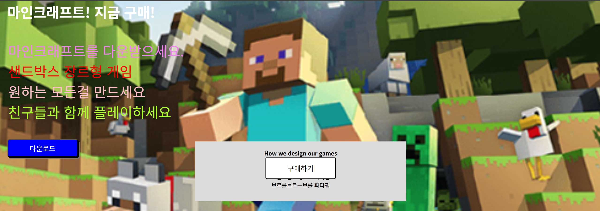
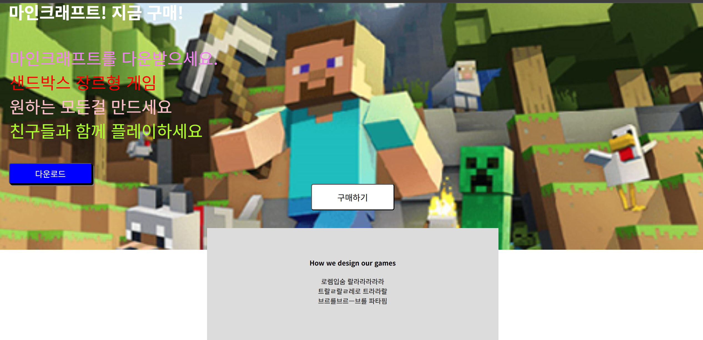

# z-index와 width & box-sizing (2025-05-12)
## 1. z-index

- 사진처럼 겹쳐져있던 회색 박스가 올라가서 버튼을 가리게되었다.
- 이는, 박스들이 모두 공중에 붕띄어져 있는 상황이어서 발생한 상황이다.
- 이때, 포토샵 처럼 레이어 기능과 비슷한 z-index를 사용하면, 어떤 박스가 위로 보이게 할지 정할 수 있다.
``` css
/* 사진에서 가려진 버튼 */
.main-button2 {
    padding : 15px;
    font-size : 20px;
    background:white;
    border-radius : 5px;
    /* position 때문에 공중에 띄어짐 */
    position: absolute;
    left : 0;
    right : 0;
    margin-left : auto;
    margin-right : auto;
    width : 200px;
    z-index : 5;
}

.main2-background {
    /* position 때문에 공중에 띄어짐 */
    position:absolute;
    left : 0;
    right : 0;
    margin-left : auto;
    margin-right : auto;
    top : 400px;
    width : 80%;
    max-width : 600px;
    height : 170px;
    background-color : gainsboro;
    text-align:center;
    z-index:1;
}
```
- 버튼에는 `z-index : 5`를, 회색 배경에는 `z-index : 1`을 주었다.

- 버튼이 위에 올라와 있는 것을 볼 수 있다.
- 더 높은 숫자가 더 위로 올라오게 된다.

## 2. max-width
- 지금 만든 회색 배경의 블럭은 PC 화면에서는 상관없겠지만, 크기가 작은 모바일의 경우라면 width가 너무 커서 제대로 안보일 수 있다.
- 박스가 가변적인 성질을 가지게 하고 싶다면 width:80%; 처럼 부모 width의 80% 만큼 지정하는 것 처럼 속성을 사용하면 된다.
``` html
<body>
<div class="main2-background">
    <h4>How we design our games</h4>
    <p1>
        로렘입숨 랄라라라라라<br>
        트랄ㄹ랄ㄹ레로 트라라랄<br>
        브르를브르ㅡ브를 파타핌
    </p1>
</div>
</body>
```
- 근데 이렇게, 부모 박스가 없을때는 width:가 어떻게 되나?
- 사실, 부모 박스가 없는 것은 아니다. `<body>`태그가 부모 태그가 된다.
- 따라서, 다음 코드의 `width: 80%;` 는 화면 전체 창의 80%를 할당하게 된다.
---
- 다만 `pc 화면`에서 `width:80%`를 해버리면, `박스가 너무 커지게 된다.`
- 이럴 때는, `max-width` 속성을 사용하면 된다. 최대폭을 정해놓은 다고 이해하면 된다.
``` css
.main2-background {
    /* position 때문에 공중에 띄어짐 */
    position:absolute;
    left : 0;
    right : 0;
    margin-left : auto;
    margin-right : auto;
    top : 400px;
    width : 80%;
    max-width : 600px;
    height : 170px;
    background-color : gainsboro;
    text-align:center;
    z-index:1;
}
```
- 위 코드에서 `max-width : 600px;`를 사용하여, `width의 최대 폭을 600px로 고정`하였다.

## 3. box-sizing : boarder-box;
- 1, 2단을 통해서 박스의 사이즈를 고정하는 방법까지 알아보았다.
- 만약, 여기서 padding 스타일을 추가하면 어떻게 될까?
``` css
.main2-background {
    position:absolute;
    left : 0;
    right : 0;
    margin-left : auto;
    margin-right : auto;
    top : 550px;
    width : 80%;
    max-width : 600px;
    height : 170px;
    background-color : gainsboro;
    z-index:1;
    text-align:center;
    padding : 50px;
}
```
- 맨 아래에 `padding : 50px;`를 추가하였다. 결과를 확인해보면?

- 이상하게 `max-width`로 최대 폭을 지정하였지만, `padding`을 사용하자 `박스가 커진것`을 확인할 수 있다.
- 박스를 구성하고 있는 것 아래와 같다.

  1. 박스의 내용(글자가 들어가있는) content 부분
  2. 박스의 여백 padding
  3. 박스의 테두리 boarder

- 우리가 2단에서 `max-width`로 설정한 최대 폭은 이 세 부분 중에서 `content 부분`만 `최대 폭을 설정`한 것이다.
- 따라서, `padding 부분`의 사이즈를 `50px로 추가`하면 `당연히 박스가 커지게 되는 것`이다.
---
- 우리는 박스의 폭이 고정된 것을 원한다. 어떻게 해야될까?
- `max-width로 폭을 고정`할 때, `content만 하지 말고 border, padding 부분 모두 고정`하라 명령하면 된다.
``` css
.main2-background {
    position:absolute;
    left : 0;
    right : 0;
    margin-left : auto;
    margin-right : auto;
    top : 550px;
    width : 80%;
    max-width : 600px;
    height : 170px;
    background-color : gainsboro;
    z-index:1;
    text-align:center;
    padding : 10px;
    box-sizing : border-box;
}
```
- 맨 아랫줄에 추가된 `box-sizing : border-box;` 가 보이는가?
- 이 코드를 통해, `max-width`를 `모든 영역을 포함해서 설정`하라고 `명령하는 코드`이다.
- 이게 없으면, 실제 폭을 내가 원하는 수치로 고정시키기 힘들다.
``` css
.div {
    box-sizing : border-box;
}
```
- 이런 식으로, `css 파일`에서 `모든 div 박스`에 `box-sizing : border-box;`를 해놓으면 모든 박스에 설정이 가능하니 편리하게 된다.
- css 파일 맨 위에 이걸 작성해 놓자.
---
---
- 덤으로 CSS 파일 작성 시 기본적으로 추가해 놓으면 좋은 속성들을 작성해두겠다.
``` css
div { /* 박스 사이즈를 조절할 때 모든 영역을 설정한다 */
  box-sizing : border-box;
}
body { /* 기본 바디 태그에서 여백을 없앤다 */
  margin : 0;
}
html {  /* 기본 행간 높이을 조절한다 */
  line-height : 1.15;
}
```

## 4. Normalize에 대해서
- 브라우저마다 박스나 버튼 같은 디자인들이 달라지게 보여질 수 있다.
- 이런 브라우저 간의 호환성을 위해 css 파일 위에 막 작성해 놓는게 있다.
- 이런 걸 모아 놓은게 `normalize css 파일`이다.
- css 파일을 저장해 놓고.
``` html
<!-- html 파일 -->
<!Doctype html>
<html>
    <head>
        <meta charset="UTF-8">
        <title>Document</title>
        <link href="다운받은 normalize css 파일 링크">
```
- 위 처럼 html 파일 `내부에서 link를 해버리는 방법`도 있다.