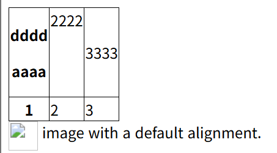

# Table 레이아웃과 vertical-align 속성 (2025-05-13)

- 위 같은 표를 만드는 코드를 작성해보자.
```html
<!-- html 파일 내부 -->
<!DOCTYPE html>
<html>
<head>
    <meta charset="UTF-8">
    <meta name="viewport" content="width=device-width, initial-scale=1.0">
    <title>Document</title>
    <link href="CSS/13강.css" rel="stylesheet">
</head>
<body>
    <div>
        <table>
            <!-- 제목 행은 <thead>안에 작성 -->
            <thead>
                <!-- tr(행) 먼저 만들고 그 다음에 td(열) 만들기 -->
                <tr>
                    <!-- th 사용시 글자가 굵어짐 -->
                    <th>
                        <p>dddd</p>
                        <p>aaaa</p>
                    </th>
                    <!-- vertical-align : 테이블 셀 내에서 상하정렬을 도와줌 -->
                    <td style="vertical-align:top">2222</td>
                    <td style="vertical-align:middle">3333</td>
                </tr>
            </thead>

            <!-- 일반 행은 <tbody>안에 작성 -->
            <tbody>
                <tr>
                    <!-- th 사용시 글자가 굵어짐 -->
                    <th>1</th>
                    <td>2</td>
                    <td>3</td>
                </tr>
            </tbody>
        </table>
    </div>
    <!-- text-align 사용해보기(정렬을 할 수 있다) -->
    <div>  
        <span style="vertical-align:top">image with a default alignment.</span></div>
</body>
</html>
```
``` css
/* css파일 내부 */
td, th {
    border:1px solid black;
}

table {
    /* 테이블에서 셀 간의 간격을 없애는 코드 */
    border-collapse : collapse;
}
```
- 코드를 보면서 짜보면 어렵지 않게 습득할 수 있다.
- `tr(row, 행)`을 먼저 작성하고 `td(column, 열)`에 해당하는 숫자를 입력해서 표를 제작한다.
- `vertical-align` 스타일을 사용하여 `셀내부`와 `<span>`같은 display-inline 요소들을 나란히 배치할 때 상하정렬을 도와주는 스타일이다.
- top, middle, bottom 말고도 super, sub, px와 같은 단위도 사용가능하지만, `테이블 내`에서는 무조건 `top, middle, bottom만 사용가능`하다.
---
```css
.box {
  display : table;
  display : table-row;
  display : table-cell;
}
```
- 가끔, div로 이루어진 요소들을 테이블화 시키고 싶을 수 있다.
- 그럴 때는 변하게 하고 싶은 요소에 `display:table`을 작성한 후
- `tr(행)로 만들 요소`에는 `table-row` / `td(열)`로 만들 요소에는 `table-cell`을 작성한다.

## 2. 과제 하기
