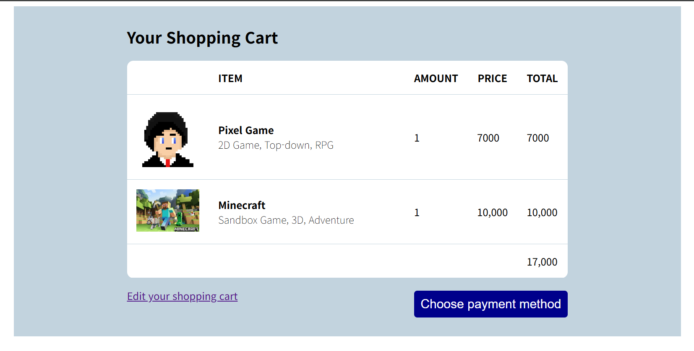

# 장바구니 레이아웃 만들어보기(과제 다시 해보기) (2025-05-14)
<br>
<br>
- 위 사진들 처럼 창이 움직여도 사이즈가 그대로 유지되는 레이아웃을 제작한다.
```html
<!DOCTYPE html>
<html lang>
<head>
    <meta charset="UTF-8">
    <meta name="viewport" content="width=device-width, initial-scale=1.0">
    <title>Document</title>
    <link href="CSS/practice3.css" rel="stylesheet">
</head>
<body>
    <div class="cart-background">
        <h3 class="box" style="font-size : 25px; padding-bottom : 20px;">Your Shopping Cart</h3>
        <!-- 4행 5열의 표 제작 -->
        <table class="box cart-table">
            <thead>
                <tr>
                    <th></th>
                    <th style="text-align : left;">ITEM</th>
                    <th>AMOUNT</th>
                    <th>PRICE</th>
                    <th>TOTAL</th>
                </tr>
            </thead>
            <tbody>
                <tr>
                    <td></td>
                    <td>
                        <span style="font-weight : bold;">Pixel Game<br></span>
                        <span style="font-weight : lighter">2D Game, Top-down, RPG</span>
                    </td>
                    <td>1</td>
                    <td>7000</td>
                    <td>7000</td>
                </tr>
                <tr>
                    <td></td>
                    <td>
                        <span style="font-weight : bold;">Minecraft<br></span>
                        <span style="font-weight : lighter">Sandbox Game, 3D, Adventure</span>
                    </td>
                    <td>1</td>
                    <td>10,000</td>
                    <td>10,000</td>
                </tr>
                <tr>
                    <td colspan="4"></td>
                    <td>17,000</td>
                </tr>
            </tbody>
        </table>
        <div class="box">
            <p style="width:50%; float:left;"><a href="#">Edit your shopping cart</a></p>
            <button type="submit" class="button-style">Choose payment method</button>
        </div>
        <div style="clear:both;"></div>
    </div>
</body>
</html>
```
```css
.cart-background {
    width : 100%;
    max-width : 1000px;
    background-color : #c2d3de;
    padding : 30px;
    margin : auto;
}

.box {
    /* 테이블이 화면 창 크기에 맞춰 변하게 만듬 */
    width : 100%;
    /* 최대 사이즈를 지정해서 필요 이상으로 커지는걸 막음 */
    max-width : 700px;
    /* 가운데 정렬 */ 
    margin : auto;
}

td, tr, table {
    border-collapse: collapse;
}

.cart-table {
    background:white;
    border-radius : 10px;
}
/* cart-table 속 모든 td와 th */
.cart-table td, .cart-table th{
    padding : 15px;
    border-bottom : 1px solid #c2d3de;
}
/* cart-table 속 모든 th 중 3번째 나오는  */
.cart-table th:nth-child(2) {
    width : 700px;
}

.cell-long {
    /* 테이블 속 다른 셀들의 최소폭을 건드리지 않는 선에서 width를 조절해달라 */
    width : 700px;
}

.button-style {
    background-color : darkblue;
    border : 0px;
    border-radius : 5px;
    float:right;
    font-size : 20px;
    padding : 10px;
    color : white;
    margin-top : 20px;
}
```
- css파일 내부에서 margin-auto를 적극적으로 사용해서 가운데 정렬을 구현하였다.
- 13강에서의 레이아웃을 제작할 때는 `4행 4열의 표`를 만들어서, `이미지와 글자를 하나의 셀`에 만들러고 함.
- `여기서는` `4행 5열의 표`를 만들어, `이미지가 들어갈 셀과 글이 들어갈 셀을 구분하여 제작`하였다. => 더욱 깔끔해지고 쉽게 의도한 대로 레이아웃이 제작되었다.
---
- css 파일 속, `th:nth-child(2)`로 `nth-child()` 문법을 사용하였다.
- 위 문법은 테이블에서 모든 th 중에서 3번째로 나오는 th에 스타일을 준다고 이해하면 된다.
---
- 13강에서의 레이아웃과 비교하면, 더욱 뛰어난 레이아웃으로 변하였다.
1. `클래스의 재사용`
2. `화면의 창에 따른 레이아웃 크기의 변화 구현`
3. `깔끔한 레이아웃 구현`
- 위 세가지의 요소를 생각하면서 웹사이트를 구현하도록 노력하자.