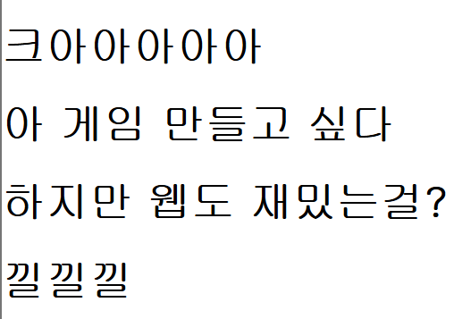
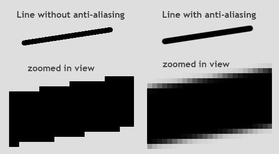

# 웹폰트와 안티엘리어싱 (2025-05-16)
## 1. 글자 폰트 꾸며주기
- 글자 글꼴을 책임지는 `폰트를 적용`시켜보자.
``` css
body {
    margin: 0px;
    /* font 정하기 */
    /* font-family는 inherit(상속)된다. 모든 body 태그가 글꼴을 갖게 함. */
    font-family : 'gulim', 'dotum', 'arial'; 
}
```
- 버그없이 사용하기 위해선, `영문`을 사용해야 한다.
- 폰트명은 콤마로 구분하며, `왼쪽에 있는 폰트를 적용`하며, 만약 적용 실패시? 그 다음 폰트를 적용한다.
- 웹 사이트 이용자의 `컴퓨터 내부에 설치된 폰트들을 이용 가능`하다.
``` css
body {
    margin: 0px;
    font-family : 'nanumsquare', 'dotum', 'arial'; 
}
```
- 만약, 다운로드가 필요한 나눔스퀘어 같은 폰트를 사용한다면,
- 나눔스퀘어 글꼴이 없는 컴퓨터에는 해당 폰트가 안보이게 된다.

## 2. 컴퓨터 내부에 설치되어 있지 않는 폰트를 사용하게 하고 싶다면?
- 원하는 폰트파일(.ttf)을 VS Code 폴더 속에 저장해둔다.
``` css
@font-face {
    font-family : '이쁜분필폰트';
    src : url(../210\ 하얀분필L.ttf)
}

div, input, textarea {
    box-sizing : border-box;
}

body {
    margin: 0px;
    /* font 정하기 */
    /* font-family는 inherit(상속)된다. 모든 body 태그가 글꼴을 갖게 함. */
    font-family : '이쁜분필폰트'; 
}
```
- 맨 위에 `@font-face` 가 보이는가?
- `@font-face`를 사용하여, 우리가 준비한 `커스텀 폰트`를 `css` 파일에서 사용할 수 있게 등록한다.
- 이제, `이쁜분필폰트` 라는 글꼴을 사용할 수 있게 되었다.
- 한글 폰트는 크기가 크기 때문에 많이 쓰지말자

## 3. 웹에서 사용하기 위한 `woff 파일` 
- 웹에서 사용하기 용이한 폰트인 .woff 가 등장하였다.
- 2단에서 설명했듯, 한글 폰트는 크기가 너무 커서 많이 사용될 시, 사이트 로딩이 오래 걸리거나, 렉이 걸리는 등에 문제가 발생할 염려가 있다.
- `woff 파일`은, `웹 용`으로 만들어진 폰트로, 크기가 `ttf 보다 현저히 작은게 특징`이다.
``` css
@font-face {
    font-family : '가벼운나눔스퀘어폰트';
    src : url(../NanumSquareR.woff)
}

div, input, textarea {
    box-sizing : border-box;
}

body {
    margin: 0px;
    font-family : '가벼운나눔스퀘어폰트'; 
}
```
- 사용법은 ttf와 동일하다.

## 4. 굳이 폰트파일을 넣어가지고 막 해야되나요... 귀찮은데 ㅋㅋㅋㅋ
- 라는 당신을 위한 사이트가 있다.<br>
<br>
- [구글 폰트](fonts.google.com)(Google fonts)라는 사이트로, 폰트파일을 호스팅해주는 사이트이다.
- 여기서 원하는 폰트를 찾아서 `<link>`태그로 `html 파일`에서 사용하든가, `@import`를 사용해서 `css` 파일에서 사용하면 된다.
- 우리가 전달하는 폰트가 아닌, 구글이 보내는 폰트이기에 사이트가 더욱 빨라지는 효과를 보여준다.

## 5. 글자 이쁘게 만들기 팁 : 안티 앨리어싱
``` css
div, input, textarea {
    box-sizing : border-box;
}

body {
    margin: 0px;
    font-family : 'gulim'; 
}
```
- `굴림` 폰트를 적용시키고 글자를 작성해보자.<br>
<br>
- 이쁜 글씨가 나오지만, 확대해서 보면, 글자가 살짝 깨지는 듯한 모습이 보이기도 한다.<br>
<br>
- 픽셀아트에서 배운 `안티앨리어싱`이 윈도우 화면에서는 전혀 안되기 때문에 발생하는 문제이다.
---
- 그렇다면 `야매`로 안티앨리어싱을 적용시키는 방법을 알아보자.
``` css
div, input, textarea {
    box-sizing : border-box;
}

body {
    margin: 0px;
    font-family : 'gulim'; 
}

p, h4, h3, h2, h1, span {
    transform: rotate(0.03deg);
}   
```
- 글자가 들어가는 모든 `태그`들을 `transform : rotate(0.03deg)`를 사용하여 아주 살짝만 회전시키면 된다.<br>
.gif) <br>
- gif 화면을 보면, 차이가 보이게 된다.
