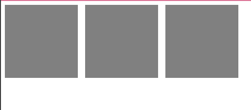

# 가로 박스 쉽게 만들기 (2025-05-17)
## 1. flex-box
- div 박스들을 가로로 배치하기 위해서 float 같은 속성들을 사용하였다.
- 이런 속성들 보다 더 쉽게 만드는 `flex-box`라는 속성을 알아보자.
``` html
<!-- html 파일 내부 -->
<body>
    <div class="flex-container">
        <div class="flex-item"></div>
        <div class="flex-item"></div>
        <div class="flex-item"></div>
    </div>
</body>
```
``` css
/* css 파일 내부 */
.flex-item {
    width : 100px;
    height : 100px;
    background-color : grey;
    margin :5px;
}
```

- 이렇게 박스 세개를 제작하였다.

### 이때, 부모 `<div>` 클래스 속, flex-container 클래스를 다음과 같이 작성한다.
``` css
.flex-container {
    display : flex;
}
```
- 작성을 완료하면, 아래와 같이 박스들이 `가로로 정렬`된다.

- 부모에다가 `display:flex;` 만 작성하면, 간단하게 된다.

### `display:flex`를 이용하면, 요소들의 배치를 매우 쉽게 구현할 수 있다.

## 2. flex 세부 속성 사용해보기
```css
.flex-container {
  display : flex;
  justify-content : center;  /* 좌우정렬, 가운데 */
  align-items : center;  /* 상하정렬, 가운데 */
  flex-direction : column; /* 세로정렬, row 사용시 가로 정렬됨 */
  flex-wrap : wrap;  /* 폭이 넘치는 요소 wrap 처리, 폭이 넘치면 박스가 박스 아래로 정리됨 */
}
.box {
  flex-grow : 2;  /* 폭이 상대적으로 몇배인지 결정 */
}
```
- 여러 속성들을 사용해서 `디자인`을 할 수 있다.

## 3. flex-grow를 통해 쉽게 정렬 만들어 버리기
``` html
<div class="flex-container">
  <div class="box"></div>
  <div class="box" style="flex-grow : 1"></div>
  <div class="box"></div>
</div>
```
- 두 번째 `<div>` 속 `style="flex-grow : 1"`이 보이는가?
- `flex-grow`를 사용하면, `박스`가 나머지 박스들에 대해서 `상대적으로 얼마나 큰지`를 `결정`해주는 속성이다.
- 사진으로 결과를 비교해보면, 어떤 말인지 알 수 있을 것이다.
``` html
    <div style="display:flex;">
        <div style="background-color : gray; width : 100px; height : 100px; margin : 5px;"></div>
        <div style="background-color : gray; width : 100px; height : 100px; margin : 5px;"></div>
        <div style="background-color : gray; width : 100px; height : 100px; margin : 5px"></div>
    </div>
```

- 적용을 안했을 때의 모습이다.
---
```html
    <div style="display:flex;">
        <div style="background-color : gray; width : 100px; height : 100px; margin : 5px;"></div>
        <div style="background-color : gray; width : 100px; height : 100px; margin : 5px; flex-grow:1;"></div>
        <div style="background-color : gray; width : 100px; height : 100px; margin : 5px"></div>
    </div>
```

- 적용했을 때의 모습이다.
- 차이가 확실히 느껴진다.

## 4. 과제, 레이아웃 만들어보기.
``` html
<!-- html 파일 내부 -->
<body>
    <div class="flex-container">
        <div class="flex-item">
            <h1>Logo</h1>
        </div>
        <div class="flex-item" style="flex-grow : 1.5"></div>
        <div class="flex-item">
            <h1>products</h1>
        </div>
        <div class="flex-item">
            <h1>services</h1>
        </div>
    </div>
</body>
```
``` css
/* css 파일 내부 */
.flex-item {
    width : 200px;;
    height : 100px;
    margin :5px;
    text-align : center;
    color : white;
    font-weight : bold;
    font-size : 21px;
}

.flex-container {
    display : flex;
    justify-content : center;
    flex-direction : row;
    background-color : palevioletred;
}
```


