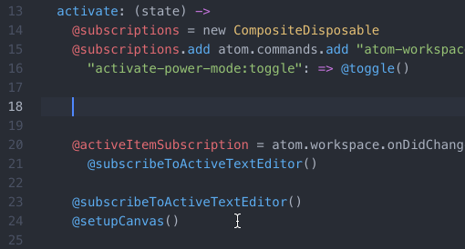

# HTML CSS 코드 짤때 유용한 Emmet와 부가기능들 (2025-05-17)
## 1. Format Document (VS Code)
- `코드를 깔끔하게 만들어주는 부가 기능`이다.
``` html
<!DOCTYPE html>
<html>
    <head>
        <meta charset="UTF-8">
        <title>Document</title>
        <link href="CSS/main2.css" rel="stylesheet">
    </head>
    <body style="margin : 0px;">
        <div class="main-background">
            <h4 class="main-title">마인크래프트! 지금 구매!</h4>
            <p1 class="main-text" style="color : violet">마인크래프트를 다운받으세요.<br></p1>
            <p1 class="main-text" style="color : red">샌드박스 장르형 게임<br></p1>
            <p1 class="main-text" style="color:pink">원하는 모든걸 만드세요<br></p1>
            <p1 class="main-text" style="color : greenyellow">친구들과 함께 플레이하세요<br></p1>
            <button class="main-button">다운로드</button><br>
            <button class="main-button2">구매하기</button>
            <div class="main2-background">
                <h4>How we design our games</h4>
                <p1>
                    로렘입숨 랄라라라라라<br>
                    트랄ㄹ랄ㄹ레로 트라라랄<br>
                    브르를브르ㅡ브를 파타핌
                </p1>
            </div>
        </div>

        <br>
        <br>
        <br>
        <br>
        <br>
        <br>

        <form>
            <input type="text">
            <input type="password">
            <input type="radio">
        </form>
    </body>
</html>
```
- `초기에 제작한 끔찍한 코드`를 가져왔다.
- html을 저장한 후, 우클릭을 누르고 명령 팔레트 (Ctrl + Shift + P)를 눌러 `명령 팔레트`를 연다.
- 이후, `Format Document`를 입력한 후 실행 시키면?<br>
.gif)
```html
<!DOCTYPE html>
<html>
  <head>
    <meta charset="UTF-8" />
    <title>Document</title>
    <link href="CSS/main2.css" rel="stylesheet" />
  </head>
  <body style="margin: 0px">
    <div class="main-background">
      <h4 class="main-title">마인크래프트! 지금 구매!</h4>
      <p1 class="main-text" style="color: violet"
        >마인크래프트를 다운받으세요.<br
      /></p1>
      <p1 class="main-text" style="color: red">샌드박스 장르형 게임<br /></p1>
      <p1 class="main-text" style="color: pink"
        >원하는 모든걸 만드세요<br
      /></p1>
      <p1 class="main-text" style="color: greenyellow"
        >친구들과 함께 플레이하세요<br
      /></p1>
      <button class="main-button">다운로드</button><br />
      <button class="main-button2">구매하기</button>
      <div class="main2-background">
        <h4>How we design our games</h4>
        <p1>
          로렘입숨 랄라라라라라<br />
          트랄ㄹ랄ㄹ레로 트라라랄<br />
          브르를브르ㅡ브를 파타핌
        </p1>
      </div>
    </div>

    <br />
    <br />
    <br />
    <br />
    <br />
    <br />

    <form>
      <input type="text" />
      <input type="password" />
      <input type="radio" />
    </form>
  </body>
</html>
```
- `코드가 이렇게 보기 쉽게 바뀐다.`
- 설정법은 알아서 찾아보도록...

## 2. 귀찮은 박스 만들기 쉽게 하는법? : Emmet
- div 박스 여러 개를 만드는 거를 실습해보면 얼마나 귀찮은 일이지 몸소 체험이 가능하다.
- 그래서, `셀렉터`를 이용하여 HTML을 조금 쉽게 생성할 수 있는 방법이 있다.
- `Emmet`는 Vs Code에는 그냥 깔려있다. 추가적으로 뭐 할게 없다.

``` html
div.container>div
```
- 이렇게 입력하고 Tab 키를 입력해보면??
``` html
    <div class="container">
        <div></div>
    </div>
```
- ????? 갑자기 이게 `뿅`하고 만들어진다.
- 생각한 `레이아웃을 편하게 만들 수 있게 되었다`.
---
- 이런 것도 가능하다.
``` html
div#header>p.title*3
```
- 똑같이 Tab 키를 누르면?
``` html
    <div id="header">
        <p class="title"></p>
        <p class="title"></p>
        <p class="title"></p>
    </div>
```
- `p.title` 을 사용하여 `class 명`이 `title` 임을 알리고
- `div#header` 을 사용하여 `id 명`이 `header`인 `div` 태그를 만들어준다.
- 마지막으로 `*3` 으로 인하여 총 `3개의 p 태그`가 만들어진다.
---
- CSS 작성 시, 스타일 꿀팁도 있다.
```css
m10
```
- 이렇게 작성하고 Tab키를 눌러보면?
```CSS
margin: 10px;
```
- ㅋㅋㅋㅋㅋㅋㅋ 사용하니 진짜 놀랍다.
- `mt10` = `margin-top : 10px;` 이며 / `w100%` = `width : 100%;` 이게 된다.
---
- 상단의 꿀팁들 이외에도
### 1. `!` 입력 후 `tab` 누르면 기본 `html 문서 시작 템플릿이 바로 생성`된다.
### 2. `lorem` 입력 후 `tab` 누르면 `로렘 입숨`이 생성됨
### 3. `p` 입력 후 바로 `tab` 키 누르면 `<p>`가 바로 생성된다.
- 여러 숨겨진 팁들이 있다.

## 3. 추천하는 VS Code 테마
- 열심히 코딩을 연습하다 보면 당연히 모니터 화면을 많이 보게된다.<br>

- Vs Extension 에서 이 테마를 설치해서 보면, 눈이 많이 편해진다.

## 4. 번외편 : 정신 나가는 VS Code 익스텐션<br>

- 이런 익스텐션이 있는데<br>

- ㅋㅋㅋㅋㅋㅋㅋㅋㅋㅋㅋㅋㅋ
- 어질어질한 코딩을 하고 싶다면 추천한다.
