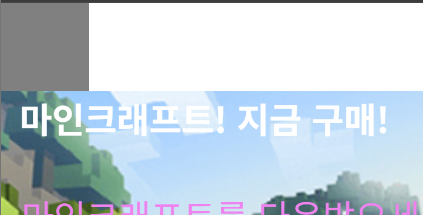

# 반응형 웹디자인 만들기 (2025-05-18)
## 1. vw, vh 단위 알아보기
```css
/* css 파일 내부 */
.test {
    width : 100px;
    height : 100px;
    background : grey;
}
```
- 우리가 일반적으로 div 박스를 만들때는, 위와 같은 형식으로 박스 디자인을 하였다.
- 이렇게 하면, 정확히 `100px, 100px 사이즈`의 박스가 제작된다.<br>

---
- 이번에는 다음과 같은 코드를 작성해보자.
``` CSS
.test {
    width : 100vw;
    height : 100px;
    background : grey;
}
```
- 단위가 px 에서 `vw` 로 바뀌었다.
- `vw` 단위가 사용되면, `현재 브라우저 창의 크기에 비례`해서 만들어지게 된다.<br>

- 맨 위쪽에 회색 박스가, `브라우저 창에 맞추어서 늘려지거나 줄어지는 걸 확인`할 수 있다.

``` CSS
.test {
    width : 100vw;
    height : 50vh;
    background : grey;
}
```
- 똑같은 방식의 세로 형태인 `vh` 단위도 존재한다.

## 2. rem 단위 및 다른 단위들도 알아보기
``` css
.test {
    width : 16px; /* 기본 px 단위 */
    width : 10rem; /* html 태그 혹은 기본 폰트 사이즈의 10배 */
    width : 2em; /* 내 폰트 사이즈 혹은 상위요소의 폰트 사이즈의 2배 */
}
```
- rem, em 와 같은 단위 사이즈도 존재한다.

## 3. 반응형 웹사이트 만들기
- 반응형 웹사이트를 만들기 전, 아래 코드를 `<head>` 태그 속에 작성해야 된다.
``` CSS
<meta name="viewport" content="width=device-width, initial-scale=1.0">
```
- 이후, CSS 파일로 들어가 CSS 파일 맨 아래에 다음과 같이 작성한다.
``` CSS
@media screen and (max-width : 1200px) {
    .main-title {
        font-size : 30px;
    }
    .main-text {
        font-size : 20px;
    }
}
```
- `브라우저 폭 1200px 이하`에서는 `main-title` , `main-text` 클래스에서 이 `스타일을 추가`하라는 `media query` 문법을 사용한다.<br>
.gif)
- gif 파일을 보면, `브라우저 창에 따라 글자 크기가 달라지는 걸 볼 수 있다`.
- `media query` 속에는 몇 개의 클래스가 들어가든 상관이 없다. 또한, 클래스 속 스타일의 제한도 없다.
- 또한, media query 는 여러 개를 작성할 수도 있다.
### 다만! `media query` 문법은, `CSS` 파일 맨 아래에 작성되어야 한다!
``` CSS
@media screen and (max-width : 1200px) {
    .main-title {
        font-size : 30px;
    }
    .main-text {
        font-size : 20px;
    }
}

@media screen and (max-width : 768px) {
    .main-title {
        font-size : 20px;
    }
}
```
- `1200px 이하`, `768px 이하`에서 각각 `폰트 사이즈가 달라지게 된다`.
``` CSS
@media screen and (max-width : 1200px) {
    .main-title {
        font-size : 30px;
    }
    .main-text {
        font-size : 20px;
    }
}

@media screen and (max-width : 768px) {
    .main-title {
        font-size : 20px;
    }
}

@media screen and (max-width : 576px) {
    .main-title {
        font-size : 10px;
    }
}
```
- 이런 식으로, 여러 크기에서의 `breakpoint` 를 설정하여, `웹사이트의 크기`에 맞춰 반응형 `웹을 디자인` 할 수 있다.

## 4. 과제 해오기 (내가 만든 버전)
```html
<!-- html 파일 내부 -->
<!DOCTYPE html>
<html>
<head>
    <meta charset="UTF-8">
    <meta name="viewport" content="width=device-width, initial-scale=1.0">
    <title>Document</title>
    <link href="CSS/practice4.css" rel="stylesheet">
    <meta name="viewport" content="width=device-width, initial-scale=1.0">
</head>
<body>
    <div class="container">
        <div class="box">
            <h3>Fash Shipping</h3>
            <p>lorem ipsum</p>
        </div>
        <div class="box">
            <h3>Good Service</h3>
            <p>lorem ipsum</p>
        </div>
        <div class="box">
            <h3>Free Coupons</h3>
            <p>lorem ipsum</p>
        </div>
        <div class="box">
            <h3>New Products</h3>
            <p>lorem ipsum</p>
        </div>
        
    </div>
</body>
</html>
```
``` CSS
/* CSS 파일 내부 */
.container {
    background-color : gray;
    display : flex;
    justify-content : center;
    align-items : center;
    margin: 0px;
}

.box {
    width : 200px;
    height : auto;;
    margin: 10px;
    text-align : center;
}

@media screen and (max-width : 1200px) {

}

@media screen and (max-width : 768px) {
    .container {
        display :grid;
        grid-template-columns : 1fr 1fr;
        grid-template-rows : auto auto;
        justify-content : center;
        align-items : center;
    }
}

@media screen and (max-width : 576px) {
    .container {
        display :grid;
        grid-template-columns : 1fr;
        grid-template-rows : auto;
        justify-content : center;
        align-items : center;
    }
}
```
.gif)
- 각 화면에 맞추어서, 박스들이 2열, 1열로 정렬되게 만들었다.
- `display-gird` 라는 새로운 개념을 사용해보았다.

## 5. 과제 해오기 (쌤 버전)
```html
<!DOCTYPE html>
<html>
<head>
    <meta charset="UTF-8">
    <meta name="viewport" content="width=device-width, initial-scale=1.0">
    <title>Document</title>
    <link href="CSS/practice4.css" rel="stylesheet">
    <meta name="viewport" content="width=device-width, initial-scale=1.0">
</head>
<body>
    <div class="product-container">
        <div>
            <h4>Fast Shipping</h4>
            <p>lorem ipsum</p>
        </div>
        <div>
            <h4>Good Service</h4>
            <p>lorem ipsum</p>
        </div>
        <div>
            <h4>Free Coupon</h4>
            <p>lorem ipsum</p>
        </div>
        <div>
            <h4>New Products</h4>
            <p>lorem ipsum</p>
        </div>
    </div>
    <!-- 붕 뜬 친구들 무시하기 위한 박스 구성 -->
    <div style="float : none; clear : both;"></div>
</body>
</html>
```
``` CSS
.product-container {
    width : 80%;
    max-width : 1000px;
    margin : auto;
    margin-top : 50px;
    margin-bottom : 50px;
}
.product-container div {
    float : left;
    /* pc 화면에서는 각 박스들의 width 가 25% 크기 */
    width : 25%;
    text-align : center;
}

/* 태블릿 사이즈 아래에서는 다음 스타일 적용 */
@media screen and (max-width : 1200px) {
    .product-container div {
        /* 태블릿 화면에서는 각 박스들의 width 가 50% 크기 */
        width : 50%;
    }
    .product-container {
        max-width : 600px;
    }
}

/* 모바일 사이즈에서는 아래 스타일 적용*/
@media screen and (max-width : 768px) {
    .product-container div {
        /* 모바일 화면에서는 각 박스들의 width 가 100% 크기 */
        width : 100%;
    }
}
```
- `셀렉터` 문법과 `width를 % 단위`로 조절하여서 만들어냈다.<br>
.gif)
- 세 개의 단위로 나누어야 되었구나.