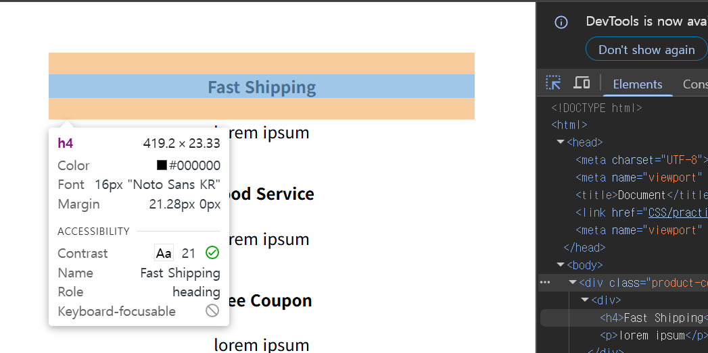

# CSS 디버깅 및 개발자 도구 잘 활용해보기 (2025-05-19)
## 1. HTML 웹 문서를 열고 디버깅하기
- 21강에서 만든 html을 열어보자. 

- `HTML과 CSS`를 가지고 웹 문서를 꾸미고 만들고 하다보면, 내가 준 스타일이 적용이 안되고 박스가 이상한데 생기고...
- `다양한 경우`가 생긴다. 이를 우리는 `버그가 생겼다`고 이야기한다.
- 이럴 때, 스타일을 적용한 `CSS` 파일이나 `html` 파일 속 `코드`를 살펴보면서, `버그가 생긴 부분을 찾고 고쳐야 한다`. 이 과정을 `디버깅`한다고 이야기 한다.
- 그러면 디버깅을 할때 `수 많은 CSS 파일의 코드들`을 다 봐야되냐? `당연한 말씀`.
- 그런 당신을 위해, `디버깅에 도움이 될 방법`을 가져왔다.
- 바로 `HTML 웹 문서에서 디버깅을 하는 방법`이다. 

- `크롬 웹사이트`로 `HTML 문서`를 연 다음, HTML 에서 `마우스 우클릭`을 누른 후, `검사`를 누른다.
- `검사` 버튼을 누르면, gif 파일 처럼 `옆에 새로운 창`이 생긴다. 

- 이게 바로 웹 에서 html 파일을 디버깅하기 쉽게 만들어준 기능이다.
- 내가 짠 `HTML 코드`를 이곳에서 확인할 수 있으며, 각 `
` 태그들에 `마우스`를 올려놓으면, 그 `
` 태그가 보이게 된다. 
.gif)
- 마우스를 올려놓으니, 해당 `
` 태그 박스들이 `파란색`으로 보이는게 보이는가?
- 아니면, 위에 위에 사진 속 `빨간색 사각형`이 가리키는 `버튼`을 누르고, `원하는 부분`을 `클릭`해보자. 

- 저 사진을 클릭하지 않고, 아직 `마우스 포인터만 올려놓은 사진`으로, 마우스 포인터를 올려놓았을 때, `파란색 부분`이 `실제 글자가 들어간 박스`, `주황색 부분`이 `박스의 margin` 부분이다.
---
## 더 자세하게 알아보기 위해, 우리가 예전에 만든 레이아웃을 켜보자.
.gif)
- 예전에 만든 복잡한 레이아웃을 가져왔다.
- 여러 박스들의 실제 모습을 확인할 수 있다. 

- 우리는 저 위에 핑크색 글자로 만든 박스를 클릭하고 아래를 보면,
- 빨간색 박스로 강조한 부분이 보이게 된다.
- 이곳은, 이 박스에 `스타일이 적용되는 순서`를 보여주는 공간으로 생각하면 된다.
- 맨 위로 가있는 스타일일 수록 `적용이 먼저 된다`. 

- 따라서, 두 번째에 있는 `font-size : 20px` 가 `적용`이 되고, 아래에 있는 `font-size : 40px;` 는 `적용되지 않는 모습`을 볼 수 있다.
- `가로선이 쳐져있는 스타일은 적용이 안되는 스타일`이다.
- 마찬가지로 `color : violet`은 `적용`이 되어 가로선이 없으며, `color : black` 은 적용이 안되어 `가로선`이 쳐져있게 된다. 

- 이 공간은, `해당 박스가 가진 margin, border, padding` 그리고 자신의 사이즈가 어떻게 구성되어 있는지 보여주는 공간이다.
- `마진`이나 `패딩`으로 박스를 꾸밀 때 유용하게 사용할 수 있다.
---
.gif)
- 해당 디버깅 창에서, style을 수정해서 볼 수는 있지만, 여기서 바꾼 내용은 CSS 파일에 직접 저장되는 것은 아니다.
- 따라서, 다시 `CSS` 파일로 넘어가서 코드를 수정해줘야 한다.
## 2. user agent stylesheet

- 알려준 대로 크롬에서 디버깅을 하다보면, `use agent stylesheet` 라고 적혀있는 공간이 있는 걸 볼 수 있다.
- 여기는 `브라우저가 기본적으로 제공하는 스타일`이다. 여기는 수정할 수가 없다.
- 크롬 브라우저가 디버깅할 때는 최고다. `크롬 상시 숭배`