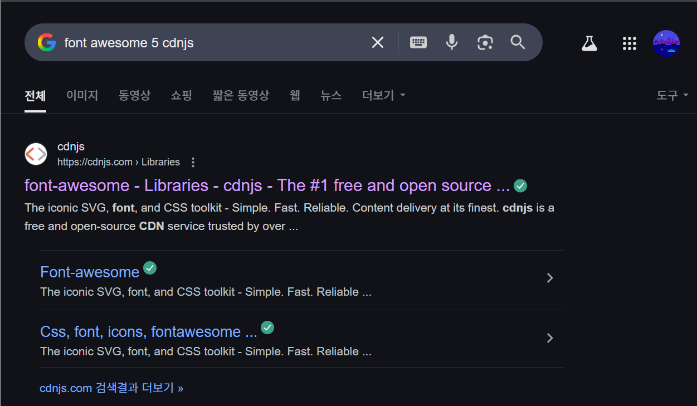
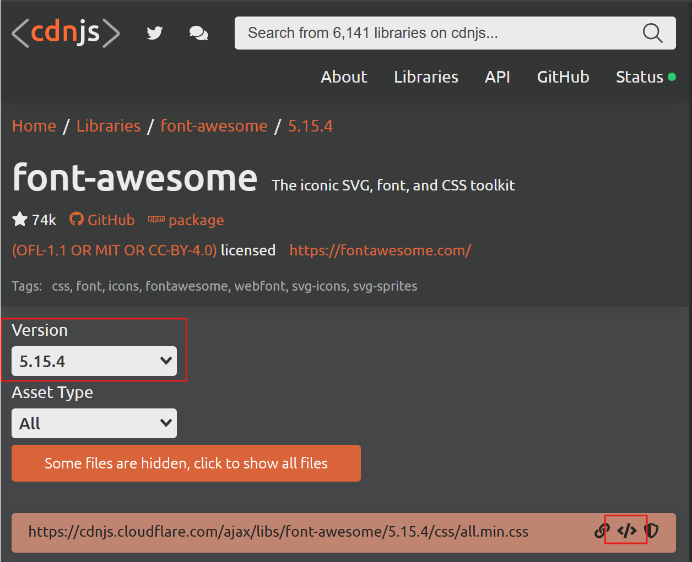
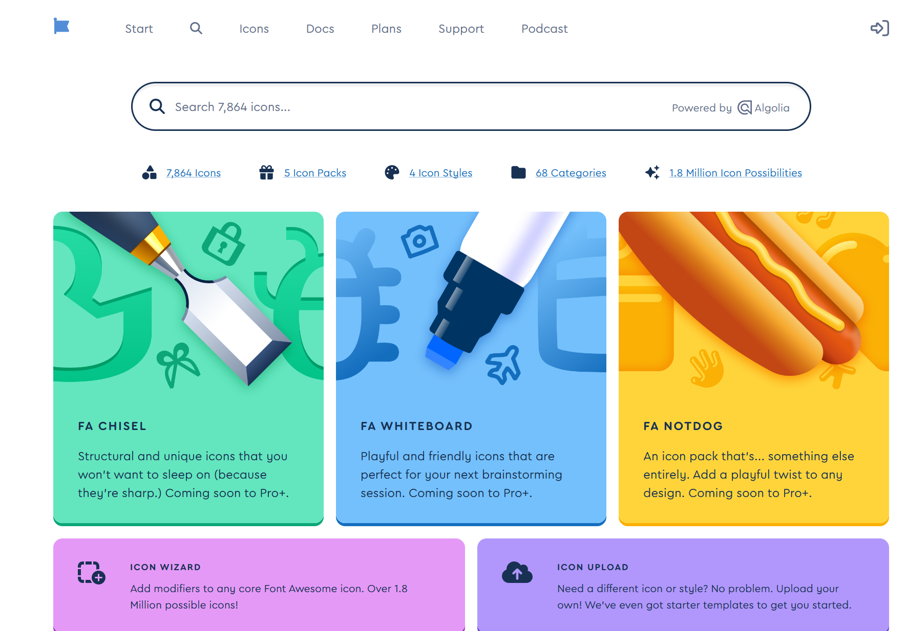
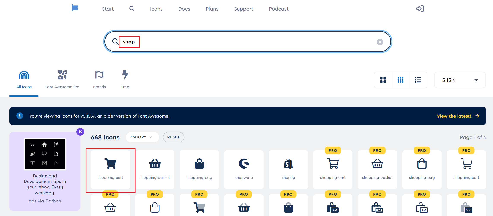
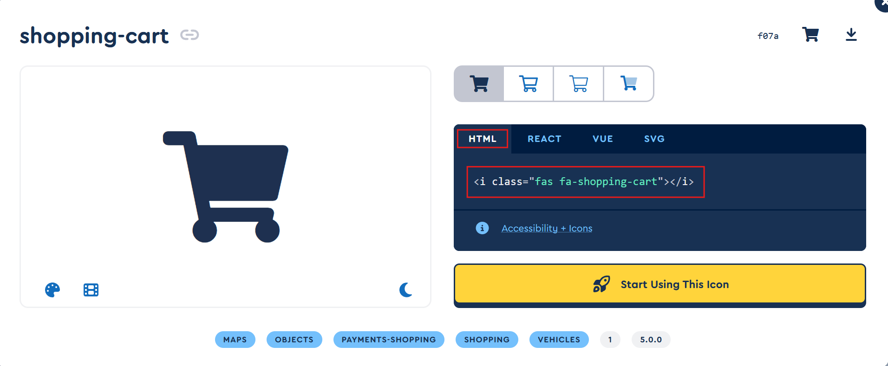
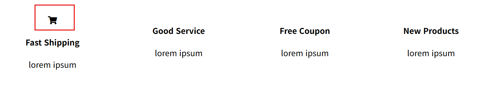
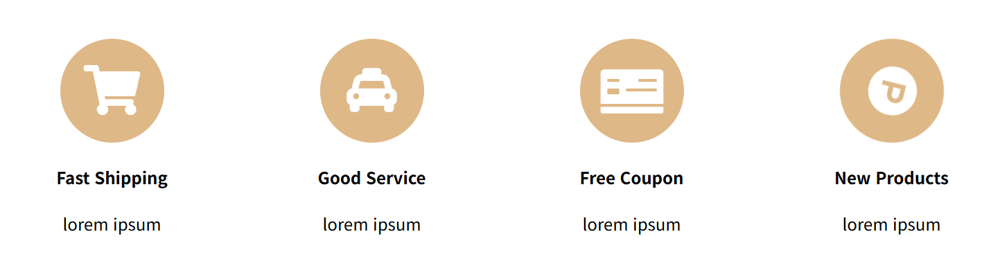

# 웹사이트 아이콘 만들어보기 (2025-05-20)
## 1. Font Awesome 라이브러리
- 사이트에 아이콘을 넣는 방법으로 이미지를 만들어서 `` 방식으로 이미지를 직접 첨부할 수 있다.
- 그런데 언제 이렇게 이미지로 다 디자인하고 할겁니까? 간단한 웹사이트를 제작한다고 해도 다른 디자인 프로그램 켜서 디자인 할것인가?
- 라고 생각하는 당신을 위한 `간단한 디자인 라이브러리`를 준비했다.<br>
<br>
- `구글`에 `font awesome 5 cdnjs` 라고 검색해보자.<br>
<br>
- 버전을 `5.15.4` 로 맞추고, 아래쪽 `/all.min.css` 부분속 html 복사 버튼을 누른다.
- 그 후, 아이콘을 제작하고 싶은 `웹 문서 html` 속 `<head>` 부분에 붙여넣기를 하면 된다.
``` html
<head>
    <meta charset="UTF-8">
    <meta name="viewport" content="width=device-width, initial-scale=1.0">
    <title>Document</title>
    <link href="CSS/practice4.css" rel="stylesheet">
    <meta name="viewport" content="width=device-width, initial-scale=1.0">
    <!-- 붙여넣기를 하면, 아래 코드가 추가된다. -->
    <link rel="stylesheet" 
    href="https://cdnjs.cloudflare.com/ajax/libs/font-awesome/5.15.4/css/all.min.css" 
    integrity="sha512-1ycn6IcaQQ40/MKBW2W4Rhis/DbILU74C1vSrLJxCq57o941Ym01SwNsOMqvEBFlcgUa6xLiPY/NS5R+E6ztJQ==" 
    crossorigin="anonymous" referrerpolicy="no-referrer" />
</head>
```
- 이렇게 하면 준비가 된 것이다.
- 이는, font awesome 사이트에서 아이콘들의 라이브러리를 링크 형식으로 불러오는 방식이다.
- 간단히 `링크만 붙여넣기` 해서 아이콘을 만들 수 있는 방법이다.
- 하지만, 위 방법은, font awesome 사이트가 다운되면, 저 링크를 사용할 수 없는 불안함이 존재한다.
- 이 불안함을 없앨러면, `font awesome 사이트`에서 `직접 css 파일을 다운` 받은 후, 적용시키면 된다.
- 하는 법은 알아서 찾아보도록 하자. ㅎㅎ

## 2. 이제 아이콘을 첨부해보록 하자.
- 우리는 `font-awesome 5.15.4` 버전을 `<head>` 태그에 `링크`하였기 때문에, 구글에서 `font awesome 5` 버전을 검색해서 사이트에 들어간다.
- [font awesome ver.5](https://fontawesome.com/v5/icons) 사이트 링크를 넣어놨다. 이거 클릭해서 들어가도 됨.<br>
<br>
<br>
- 사이트 메인화면이 이렇게 구성된다. 여기서! `링크에 /v5/` 가 있는지 확인하라! 없으면 5 버전이 아니다!.
- 확인까지 끝냈으면, 검색 공간에 원하는 아이콘을 검색한다.<br>
<br>
- 그후, 원하는 아이콘을 클릭하라.<br>
<br>
- 원하는 아이콘을 선택하면 나오는 창에서, `HTML` 을 선택하고, `나오는 코드를 클릭`하면 자동으로 `복사`된다.
---
``` html
<body>
    <div class="product-container">
        <div>
            <i class="fas fa-shopping-cart"></i>
            <h4>Fast Shipping</h4>
            <p>lorem ipsum</p>
        </div>
        <!-- 생략 -->
    </div>
</body>
```
- 원하는 장소에 저 `코드`를 붙여넣기 하면...<br>
<br>
- 아이콘이 등장하게 된다. `귀엽다.`
- 원한다면 [font awesome 5 docs](https://docs.fontawesome.com/v5/web/setup/get-started) 사이트에 들어가서 사전을 읽어보면서 `스타일을 조정`할 수 있다.
- 아니면 `style="font-size : 30px;"` 처럼, `스타일`을 줘서 꾸밀 수도 있다.
```html
<body>
    <div class="product-container">
        <div>
            <i class="fas fa-shopping-cart fa-3x"></i>
            <h4>Fast Shipping</h4>
            <p>lorem ipsum</p>
        </div>
        <div>
            <i class="fas fa-taxi fa-3x"></i>
            <h4>Good Service</h4>
            <p>lorem ipsum</p>
        </div>
        <div>
            <i class="fas fa-money-check fa-3x fa-rotate-180"></i>
            <h4>Free Coupon</h4>
            <p>lorem ipsum</p>
        </div>
        <div>
            <i class="fab fa-product-hunt fa-3x fa-spin"></i>
            <h4>New Products</h4>
            <p>lorem ipsum</p>
        </div>
    </div>
    <!-- 붕 뜬 친구들 무시하기 위한 박스 구성 -->
    <div style="float : none; clear : both;"></div>
</body>
```
.gif)<br>
- 21강에서 제작한 웹디자인에 아이콘들을 추가해보았다. 사이트가 확실히 이뻐졌다.
## 3. 아이콘에 박스 추가해보기
- 하지만! 위를 더욱 이쁘게 만들어보자!
```CSS
.product-container i {
    background-color : burlywood;
    width : 100px;
    height : 100px;
    border-radius : 50px;
    padding-top : 25px;
    box-sizing : border-box;
    color : white;
    margin-top : 30px;
}
```
- CSS 파일에서 i 태그들에 대한 스타일을 저렇게 주면<br>
<br>
- 아이콘 뒤에 박스들이 생긴다.
- 이것이 가능한 이유는, 저 아이콘은 이미지가 아니라 폰트이기 때문이다!
- style= 도 가능한 이유가 바로 이것이다.