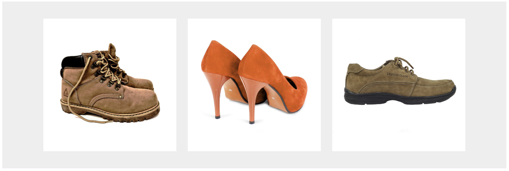

# Transition으로 CSS 애니메이션 구현하기 (2025-05-20)
## 1. 일단 레이아웃 부터 만들자
<br>
- 해당 레이아웃 부터 만들고 시작하자.
```html
    <div class="shop-bg">
        <div class="shop-container">
            <div class="shop-item">
                
            </div>
            <div class="shop-item">
                
            </div>
            <div class="shop-item">
                
            </div>
        </div>
    </div>
```
```CSS
.shop-bg {
    background-color : #eee;
    padding : 20px;
}

.shop-container {
    display : flex;
    width : 90%;
    margin : auto;
}

.shop-item {
    width : 33%;
    padding : 10px;
}

.shop-item img {
    width : 100%;
    display : block; /* display:block 을 사용함으로써, 이미지가 <div> 박스 안에서 가로줄을 전체 차지하도록 만든다. 다른 무언가가 들어오는 거를 방지하는 느낌 */
}
```

## 2. 애니메이션 만드는 Step.
- 어떤 애니메이션을 만드는 지에 상관없이, 애니메이션을 만드는 방식이 있다.
```
1. 시작 화면(시작 스타일) 제작하기 -> 애니메이션 재생 전 스타일
2. 최종 화면(최종 스타일) 제작하기 -> 애니메이션이 끝난 후 스타일
3. 어떨 때 최종 스타일로 변하는지 정하기 -> 예시 -> 마우스를 올렸을 때
4. Transition 으로 애니메이션 제작하기.
```
- 자 그럼, 만들어보자.
```html
    <div class="shop-bg">
        <div class="shop-container">
            <div class="shop-item">
                <!-- 이미지 위에 색깔을 만들 div 태그의 위치의 기준점을 만들기 위해 position:relative 사용 -->
                <div style="position: relative">
                    <div class="overlay"></div>
                    
                </div>
            </div>
            <div class="shop-item">
                <div style="position : relative">
                    <div class="overlay"></div>
                    
                </div>
            </div>
            <div class="shop-item">
                <div style="position : relative">
                    <div class="overlay"></div>
                    
                </div>
            </div>
        </div>
    </div>
```
```CSS
.overlay {
    /* position:relative 인 요소 내부에서 위치를 조절할 수 있게 됨. TIL 9강 참고 */
    position : absolute;
    width : 100%;
    height : 100%;
    background : black;
    /* 투명도 조절. 0~1 까지의 값 이용 가능 */
    opacity : 0; 
    /* 위에 있는 opacity 스타일이 변하면, 1초에 걸쳐서 서서히 변경해달라 */
    transition: opacity 1s; /* all을 사용할 시, 모든 스타일이 1초 동안 변경됨. */
}
/* overlay 박스 위에 마우스를 올리면 */
.overlay:hover {
    opacity : 0.5;
}
```
- 1. 아무것도 안하고 있을 때는, 그냥 이미지가 보임
- 2. 마우스를 올리면 `.overlay:hover` 
- 3. 이미지의 배경이 살짝 어두워진다.<br>
.gif)<br>
- 마우스 포인터의 위치에 따라 달라지는 것이 보이는가?
- 어렵지 않게 애니메이션을 만들 수 있다.

## 3. 숙제 해오기
### 전체 코드
```html
<!DOCTYPE html>
<html>
<head>
    <meta charset="UTF-8">
    <meta name="viewport" content="width=device-width, initial-scale=1.0">
    <title>Document</title>
    <link href="CSS/practice4.css" rel="stylesheet">
    <meta name="viewport" content="width=device-width, initial-scale=1.0">
    <link rel="stylesheet" 
    href="https://cdnjs.cloudflare.com/ajax/libs/font-awesome/5.15.4/css/all.min.css" 
    integrity="sha512-1ycn6IcaQQ40/MKBW2W4Rhis/DbILU74C1vSrLJxCq57o941Ym01SwNsOMqvEBFlcgUa6xLiPY/NS5R+E6ztJQ==" 
    crossorigin="anonymous" referrerpolicy="no-referrer" />
</head>
<body>
    <div class="shop-bg">
        <div class="shop-container">
            <div class="shop-item">
                <!-- overflow : hidden 을 사용하여, 박스 밖으로 넘치는 이미지, 글자를 모두 숨긴다. -->
                <div style="position:relative; overflow : hidden;">
                    <div class="overlay">
                        <h1>$60<br>인기상품</h1>
                    </div>
                    
                </div>
            </div>
            <div class="shop-item">
                <!-- overflow : hidden 을 사용하여, 박스 밖으로 넘치는 이미지, 글자를 모두 숨긴다. -->
                <div style="position:relative; overflow : hidden;">
                    <div class="overlay">
                        <h1>$0<br>무료상품</h1>
                    </div>
                    
                </div>
            </div>
            <div class="shop-item">
                <!-- overflow : hidden 을 사용하여, 박스 밖으로 넘치는 이미지, 글자를 모두 숨긴다. -->
                <div style="position:relative; overflow : hidden;">
                    <div class="overlay">
                        <h1>$1000<br>특가세일?</h1>
                    </div>
                    
                </div>
            </div>
        </div>
    </div>
</body>
</html>
```
```CSS
.shop-bg {
    background-color : #eee;
    padding : 20px;
}

.shop-container {
    display : flex;
    width : 90%;
    margin : auto;
}

.overlay {
    position : absolute;
    background-color : black;
    width : 100%;
    height : 55%;
    margin-top : 45%;
    opacity : 0;
    transition:all 1s;
    transform:translateY(150px);
}
.overlay:hover {
    opacity : 0.4;
    transform:translateY(0);
}
.overlay h1 {
    color : white;
    padding-left : 10%;
    font-size : 70px;
    line-height : 100%;
}

.shop-item {
    width : 33%;
    padding : 10px;
}

.shop-item img {
    width : 100%;
    height:100%;
    display:block;
}

/* 태블릿 사이즈 아래에서는 다음 스타일 적용 */
@media screen and (max-width : 1200px) {
    .overlay {
        transform:translateY(75px);
    }
    .overlay h1 {
        font-size : 35px;
    }
}

/* 모바일 사이즈에서는 아래 스타일 적용*/
@media screen and (max-width : 768px) {
    .overlay {
        transform:translateY(35px);
    }
    .overlay h1 {
        font-size : 25px;
    }
}
```
.gif)
- 반응형 웹사이트에 맞춰서, `translateY`의 `px` 값을 변화시켜서 정상적으로 작동하게 구성하였다.
- 또한, `overflow : hidden;` 을 사용하여, `박스 밖으로 넘치는 이미지를 잘라`서, 
- 이미지에 마우스를 올렸을 때, `이미지 바로 아래에서 박스가 생기면서 나타나는 것`처럼 구현하였다.
- 실제로는, 저 이미지가 들어간 박스 아래로 박스 하나가 생겨져있고, 이것의 Y축 위치가 위로 올라가는 구조이다. `overflow : hidden; 상시 숭배`

## 4. 다른 사이트에서 애니메이션 공부하기
- 다른 사이트에 들어가서 크롬 개발자 도구 켜서 디버깅 하면 된다.
- `디버깅 방법`은 `22강`에 설명되어 있다.
- `크롬 상시 숭배`