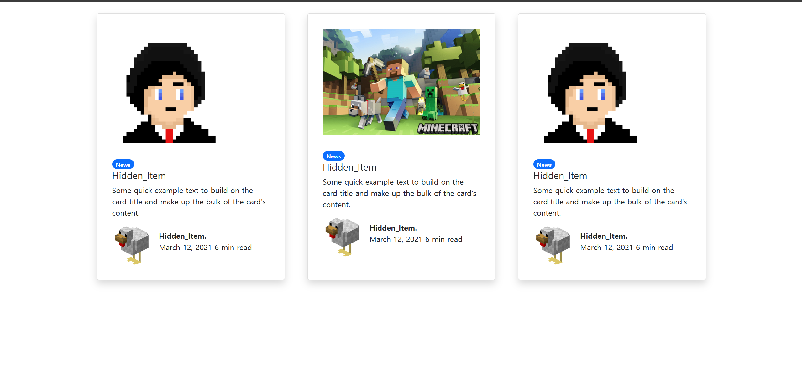

# CSS 디자인을 위한 Bootstrap 라이브러리 사용법 (2025-05-21)
## 1. Bootstrap이 뭔데?
- 우리의 html/css 디자인 시간을 단축시켜줄 이쁜 라이브러리이다. 뽀뽀해주자.
- [Bootstrap Ver.5](https://getbootstrap.com/docs/5.0/getting-started/introduction/) 해당 사이트로 이동하면 된다.
- 필자는 Bootstrap 5 버전을 사용하겠다.<br> 
<br>
- 위 사진은, 링크를 타고 들어갔을 때 나오는 사진이다.
- Bootstrap 을 사용하는 방법은 총 두가지가 있다.
> # 1. 안정적이게 사용하는 방법
> 
> 1. 우측 상단의 `Download` 버튼을 클릭한 후, CSS, JS 파일을 받운 받는다.
> 2. 다운받은 CSS 파일과 JS 파일을 작업할 HTML 폴더 속에 넣는다.
> 3. HTML의 `<head>` 태그에 아래를 작성해서 CSS 파일을 link 한다.
>>  `<link href="https://cdn.jsdelivr.net/npm/bootstrap@5.0.2/dist/css/bootstrap.min.css" rel="stylesheet" integrity="sha384-EVSTQN3/azprG1Anm3QDgpJLIm9Nao0Yz1ztcQTwFspd3yD65VohhpuuCOmLASjC" crossorigin="anonymous">`
> 4. HTML의 `<body>` 태그의 끝부분 `</body>` 태그 전에 아래를 작성한다.
>> `<script src="https://cdn.jsdelivr.net/npm/bootstrap@5.0.2/dist/js/bootstrap.bundle.min.js" integrity="sha384-MrcW6ZMFYlzcLA8Nl+NtUVF0sA7MsXsP1UyJoMp4YLEuNSfAP+JcXn/tWtIaxVXM" crossorigin="anonymous"></script>`

> # 2. 간단하게 사용하는 방법
> 1. 귀찮게 다운로드하고 적용하는 방법이 귀찮다면?<Br>
> <br>
> 2. 사이트를 내리다보면 Starter template 라고 적힌 공간이 있다.
> 3. 이 템플릿을 그대로 HTML 파일에 복사 붙여넣기 하면 된다.
> 4. 그후, HTML을 실행시켜서<br>
> <br>
> 5. 다음 화면이 생기면 성공적으로 적용된 것이다.

## 2. 그럼 사용해볼까요?
<br>
- 만들고 싶은 항목을 Search docs... 공간에 검색한다.<br>

<br>
- Buttons을 검색하면 아래와 같이 나온다.

<br>
- 그후, 원하는 디자인을 찾아서 복사 붙여넣기 하면, 바로 생기게 된다.
- 간단하지 않는가?
- 디자인이 맘에 안든다면, 붙여넣기 하고 스타일을 주고 수정하면 된다.
- Bootstrap 은 뼈대를 만들어준다고 이해하면 된다. 뼈대를 구성하고, 우리의 커스텀을 넣으면 되는 것이다.

## 3. 클래스 노가다를 줄일 Utility class
- Bootstrap 라이브러리르는, 클래스를 주고 스타일을 주는 노가다를 줄여줄 Utility class를 제공한다.
```html
    <div class="card" style="width: 18rem">
      
      <div class="card-body">
        <h5 class="card-title">Card title</h5>
        <p class="card-text">
          Some quick example text to build on the card title and make up the
          bulk of the card's content.
        </p>
        <a href="#" class="btn btn-primary">Go somewhere</a>
      </div>
    </div>
```

- 위 코드를 실행시키면 나오는 카드 디자인이다.
- 이 카드 디자인에 왼쪽에 `여백`을 좀 주고 싶다고 가정해보자.
- 그러면, div 태그 속에 class="~~~~" 사용해가지고 클래스를 주고 스타일을 적용해도 된다.
- 이거를 쉽게 만들어주는 클래스인 Utility class를 부트스트랩은 제공해준다.
```html
    <div class="container">
    <div class="card" style="width: 18rem">
      
      <div class="card-body">
        <h5 class="card-title">Card title</h5>
        <p class="card-text">
          Some quick example text to build on the card title and make up the
          bulk of the card's content.
        </p>
        <a href="#" class="btn btn-primary">Go somewhere</a>
      </div>
    </div>
    </div>
```
- 맨위에 `<div class="container">` 가 추가된 것이 보이는가?
- 이것은, 이쁜 여백을 가진 박스를 만들어주는 클래스로,

- 왼쪽에 여백이 생긴것을 볼 수 있다.
- 이렇게, 이미 만들어진 클래스를 활용하여, 추가적인 스타일 제작 없이, 간단하게 스타일을 수정하고 적용할 수 있다.

### 이런 Utility class는 어디서 찾나요?

- 사이트 좌측의 메뉴들 중, Utilities 라는 칸이 있다.
- 이곳을 열어서 찾으면 된다.
```html
<div class="container">이쁜 여백가진 박스</div>
<div class="mt-5">margin-top 쉽게 주기</div>
<div class="pb-5">padding-bottom 쉽게 주기</div>
<div class="fs-3">font-size 쉽게 주기</div>
<div class="text-center">text-align 쉽게 주기</div>
<div class="fw-bold">font-weight 쉽게 주기</div>
```
- 이렇게 많이 사용되는 것을 정리해주셨다. 코딩애플 상시 숭배

## 4. 과제 해오기
```html
<!DOCTYPE html>
<html lang="en">
  <head>
    <meta charset="utf-8" />
    <meta name="viewport" content="width=device-width, initial-scale=1" />

    <link
      href="https://cdn.jsdelivr.net/npm/bootstrap@5.0.2/dist/css/bootstrap.min.css"
      rel="stylesheet"
      integrity="sha384-EVSTQN3/azprG1Anm3QDgpJLIm9Nao0Yz1ztcQTwFspd3yD65VohhpuuCOmLASjC"
      crossorigin="anonymous"
    />

    <title>Hello, world!</title>
  </head>
  <body>
    <div class="d-flex justify-content-center m-4">
      <div
        class="card shadow p-3 mb-5 bg-body rounded me-5"
        style="width: 25rem"
      >
        
        <div class="card-body">
          <span class="badge rounded-pill bg-primary">News</span>
          <h5 class="card-title">Hidden_Item</h5>
          <p class="card-text">
            Some quick example text to build on the card title and make up the
            bulk of the card's content.
          </p>
          <div class="d-flex align-items-center">
            <div class="flex-shrink-0 w-25 p-3;">
              
            </div>
            <div class="flex-grow-1 ms-3">
              <p class="fw-bold mb-0">Hidden_Item.</p>
              <p class="fst-normal fs-6">March 12, 2021 6 min read</p>
            </div>
          </div>
        </div>
      </div>

      <div
        class="card shadow p-3 mb-5 bg-body rounded me-5"
        style="width: 25rem"
      >
        
        <div class="card-body">
          <span class="badge rounded-pill bg-primary">News</span>
          <h5 class="card-title">Hidden_Item</h5>
          <p class="card-text">
            Some quick example text to build on the card title and make up the
            bulk of the card's content.
          </p>
          <div class="d-flex align-items-center">
            <div class="flex-shrink-0 w-25 p-3;">
              
            </div>
            <div class="flex-grow-1 ms-3">
              <p class="fw-bold mb-0">Hidden_Item.</p>
              <p class="fst-normal fs-6">March 12, 2021 6 min read</p>
            </div>
          </div>
        </div>
      </div>

      <div class="card shadow p-3 mb-5 bg-body rounded" style="width: 25rem">
        
        <div class="card-body">
          <span class="badge rounded-pill bg-primary">News</span>
          <h5 class="card-title">Hidden_Item</h5>
          <p class="card-text">
            Some quick example text to build on the card title and make up the
            bulk of the card's content.
          </p>
          <div class="d-flex align-items-center">
            <div class="flex-shrink-0 w-25 p-3;">
              
            </div>
            <div class="flex-grow-1 ms-3">
              <p class="fw-bold mb-0">Hidden_Item.</p>
              <p class="fst-normal fs-6">March 12, 2021 6 min read</p>
            </div>
          </div>
        </div>
      </div>
    </div>

    <script
      src="https://cdn.jsdelivr.net/npm/bootstrap@5.0.2/dist/js/bootstrap.bundle.min.js"
      integrity="sha384-MrcW6ZMFYlzcLA8Nl+NtUVF0sA7MsXsP1UyJoMp4YLEuNSfAP+JcXn/tWtIaxVXM"
      crossorigin="anonymous"
    ></script>
  </body>
</html>
```

- class, style 아무것도 안하고 모두 다 부트스트랩 라이브러리를 통하여 제작하였다.