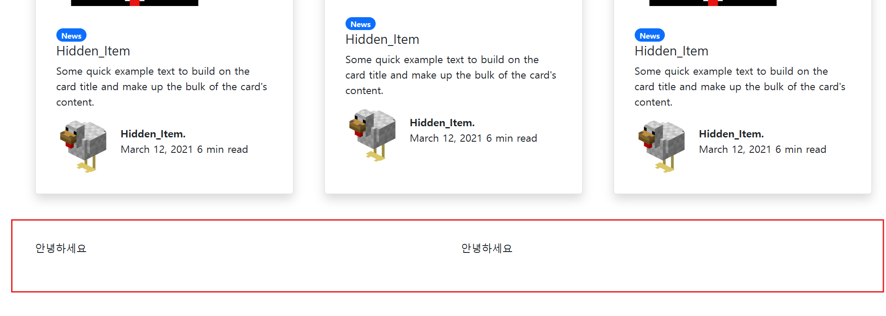
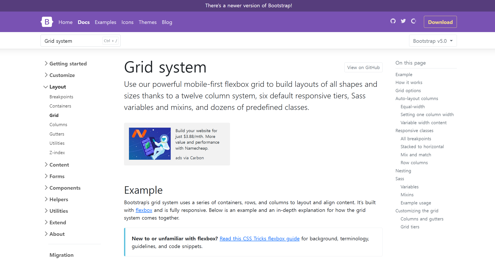
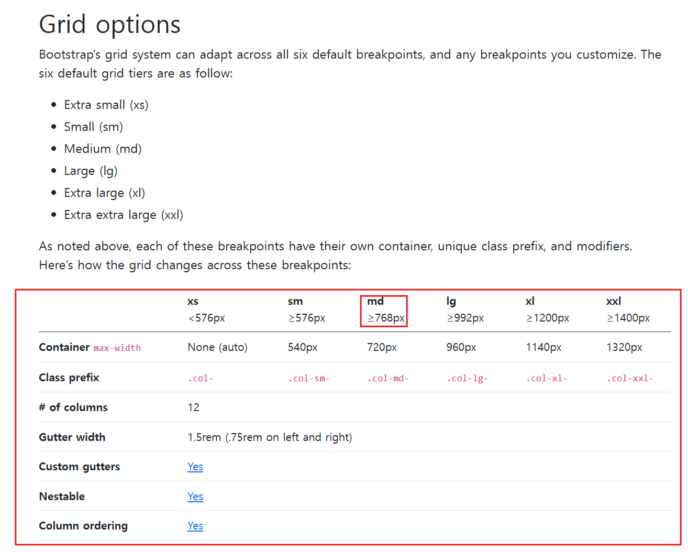
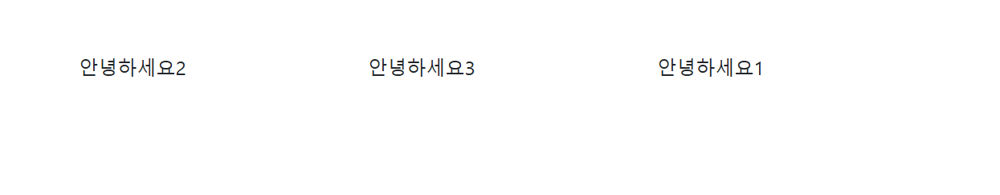
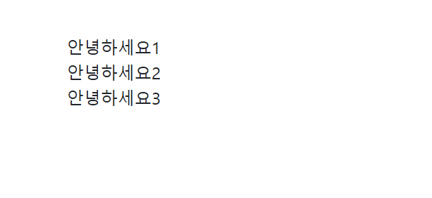

# Bootstrap 가지고 쉽게 반응형 웹 만들기 (2025-05-22)
## 1. Media query 없이도 쉽게 반응형 레이아웃 제작하기 - 기본편
- 원래 모바일이나 PC 화면에서 보이는 화면을 다르게 하는 반응형 레이아웃을 제작할 때는
```CSS
@media screen and (max-width : 992px) {
    ~~~~~
}
```
- 와 같이, media query 문법을 CSS 파일 내부에 작성해서 설정해야 했다.
### 하지만, 우리의 갓갓 Bootstrap 은 이런 반응형 레이아웃을 엄청 쉽게 제작할 수 있게 만들어준다.
```html
    <div class="container">
      <!-- row 와 col 을 사용하여, 박스들을 균일하게 쪼갤 수 있다. -->
      <!-- row로 박스 내부를 12칸으로 쪼개준다. -->
      <div class="row">
        <!-- col-4 = 12칸으로 쪼개진 박스 내부에서 4칸을 차지하겠다. -->
        <div class="col-md-6">안녕하세요</div>
        <div class="col-md-6">안녕하세요</div>
      </div>
    </div>
```
- 위 코드는, Bootstrap 라이브러리 속 코드들을 복사 붙여넣기 해서 제작한 레이아웃이다.
- `<div class="row">` 박스 내부에서 `<div class="col">` 문법을 사용하면, 박스를 쉽게 쪼갤 수 있다.
- 이게 무슨 말이냐면,<br>

<br>
- 빨간색 박스가 쳐진 부분이 바로 `<div class="row">` 박스이다.
- row 클래스는, 박스를 총 12개의 칸으로 나눈다고 생각하면 된다.
- 그러면, row 클래스가 작성된 박스 내부의 col 클래스는, 
```html
<div class="col-6">~~~</div>
<div class="col-6">~~~</div>
```
- 뒤에 적힌 6 이라는 숫자가 보이는가?
- row 클래스가 사용되어서 12개로 쪼개진 칸 중 6개의 칸을 `<div class="col-6">` 박스가 사용하겠다는 의미이다.
- col-6 클래스가 사용된 박스가 두 개 사용되었으니, row 클래스가 사용된 박스 내부에 6 | 6 칸으로 박스들이 사용되는 것이다.
- 즉, 자연스럽게 반을 쪼개서 두 박스가 나누어 가지고 있다.
```html
<div class="col-3">~~~</div>
<div class="col-3">~~~</div>
<div class="col-3">~~~</div>
<div class="col-3">~~~</div>
```
- 이런 방식으로, 12개의 칸을 3개의 칸 씩 4개의 박스로 쪼갤 수도 있다.
### 그럼 저 중간에 md는 뭐임??
## 2. 쉽게 반응형 레이아웃 만들기. - 설명편
- 우리는 지금까지의 과정으로, row와 col로 칸을 나누어서 박스들의 위치를 조정하는 방법에 대해서 배웠다.
- `md` 라는 속성을 알기 위해서는, Bootstrap 사이트 속, Grid system 에 대해서 알아야 한다.<br>

<br>
- BootStrap 사이트에서 Grid system 으로 검색하면 글이 나온다.
- 읽다보면, 우리가 위에서 설명한 row와 col 개념도 이곳에 포함된다는 것을 알 수 있다.<Br>

<br>
- Gird options 라는 항목에서 md 라는 것을 볼 수 있다.
- col-6 중간에 들어가는 md 스타일은, 일종의 조건문으로 생각하면 된다.
``` html
        <div class="col-md-6">안녕하세요</div>
        <div class="col-md-6">안녕하세요</div>
```
- 즉, 코드가 이런식으로 구성되어 있다면?
- `md 사이즈 혹은 그 이상에서만 6칸을 차지하게 해달라.`
- 라는 의미를 가지게 된다.
- 즉, md 를 사용하게 되면, 720px 사이즈 이상에서만 몇 칸을 차지하게 해달라 구성할 수 있다.
- 그럼 저 코드를 작성하게 되면 어떻게 되는가 하면<br>

.gif)<br>
- 위 gif 처럼, `720px 사이즈 이하`로 내려가게 되면, `col-6이 무시`된다.
- 즉, 그냥 `<div>` 박스가 두 개 생성된 것으로 된다.
- 이런식으로, 특정 사이즈 이하에서는 col을 무시하는 방법으로 사이즈에 맞춘 반응형 레이아웃을 만들 수 있다.

## 3. 박스들 간의 순서를 설정할 수도 있다.
```html
      <div class="row">
        <div class="col-md-4 order-3">안녕하세요1</div>
        <div class="col-md-4 order-1">안녕하세요2</div>
        <div class="col-md-4 order-2">안녕하세요3</div>
      </div>
```
- 클래스 `order-` 하고 숫자 인 클래스가 보이는가?
- 이것은 `Bootstrap` 라이브러리 속, `Order classes` 속에 들어있는 문법으로, 
- `박스의 순서`를 설정할 수 있는 `클래스`이다.

 <br>
- 결과화면은 이렇게 구성된다.
- 클래스의 order 순서대로 박스들이 정렬된 것을 확인할 수 있다.
```html
      <div class="row">
        <div class="col-md-4 order-md-3">안녕하세요1</div>
        <div class="col-md-4 order-md-1">안녕하세요2</div>
        <div class="col-md-4 order-md-2">안녕하세요3</div>
      </div>
    </div>
```
- 여기다가도 md 조건문을 달아서 반응형 레이아웃을 만들 수 있다.
- 위 코드를 작성하고 720px 이하로 창을 조절하면


- 위 화면과 같이, order 속성이 무시되고 1, 2, 3의 순서로 박스가 정렬된 것을 볼 수 있다.

## 4. 과제 해오기
### 과제 1) 창 크기에 맞춰, 레이아웃의 열 변경하는것 구현하기
```html
<!doctype html>
<html>

<meta charset="utf-8">
<meta name="viewport" content="width=device-width, initial-scale=1">
<link href="https://cdn.jsdelivr.net/npm/bootstrap@5.0.2/dist/css/bootstrap.min.css" rel="stylesheet"
    integrity="sha384-EVSTQN3/azprG1Anm3QDgpJLIm9Nao0Yz1ztcQTwFspd3yD65VohhpuuCOmLASjC" crossorigin="anonymous">

<title>Hello, world!</title>
</head>

<body>
    <div class="container">
        <div class="row">
            <div class="col-lg-3 col-sm-6">
                <div class="card" style="width: 18rem;">
                    
                    <div class="card-body">
                        <p class="card-text">Some quick example text to build on the card title and make up the bulk of
                            the card's content.</p>
                    </div>
                </div>
            </div>
            <div class="col-lg-3 col-sm-6">
                <div class="card" style="width: 18rem;">
                    
                    <div class="card-body">
                        <p class="card-text">Some quick example text to build on the card title and make up the bulk of
                            the card's content.</p>
                    </div>
                </div>
            </div>
            <div class="col-lg-3 col-sm-6">
                <div class="card" style="width: 18rem;">
                    
                    <div class="card-body">
                        <p class="card-text">Some quick example text to build on the card title and make up the bulk of
                            the card's content.</p>
                    </div>
                </div>
            </div>
            <div class="col-lg-3 col-sm-6">
                <div class="card" style="width: 18rem;">
                    
                    <div class="card-body">
                        <p class="card-text">Some quick example text to build on the card title and make up the bulk of
                            the card's content.</p>
                    </div>
                </div>
            </div>
        </div>
    </div>

    <script src="https://cdn.jsdelivr.net/npm/bootstrap@5.0.2/dist/js/bootstrap.bundle.min.js"
        integrity="sha384-MrcW6ZMFYlzcLA8Nl+NtUVF0sA7MsXsP1UyJoMp4YLEuNSfAP+JcXn/tWtIaxVXM"
        crossorigin="anonymous"></script>
</body>
</html>
```
.gif)<br>
- 위 gif 같이, 창 크기에 맞춰서 열이 바뀌게 구현하였다.

### 과제 2) 창에 따라 다르게 보이는 레이아웃 만들기
``` html
<!doctype html>
<html>

<meta charset="utf-8">
<meta name="viewport" content="width=device-width, initial-scale=1">
<link href="https://cdn.jsdelivr.net/npm/bootstrap@5.0.2/dist/css/bootstrap.min.css" rel="stylesheet"
    integrity="sha384-EVSTQN3/azprG1Anm3QDgpJLIm9Nao0Yz1ztcQTwFspd3yD65VohhpuuCOmLASjC" crossorigin="anonymous">

<title>Hello, world!</title>
</head>

<body>
    <div class="container p-3">
        <div class="row">
            <div class="col-4 col-md-2 order-md-2">
                
            </div>
            <div class="col-8 col-md-5 order-md-1 text-md-end">Lorem ipsum, dolor sit amet consectetur adipisicing elit.
                Eum, harum dolorem aperiam quod est deleniti et nobis, commodi aspernatur quae reprehenderit? Aliquam
                molestiae non sint delectus velit id quos iste.</div>
            <div class="col-md-5 order-md-3"></div>
        </div>
        <div class="row">
            <div class="col-4 col-md-2 order-md-2">
                
            </div>
            <div class="col-8 col-md-5 order-md-3 text-start">Lorem ipsum, dolor sit amet consectetur adipisicing elit.
                Eum, harum dolorem aperiam quod est deleniti et nobis, commodi aspernatur quae reprehenderit? Aliquam
                molestiae non sint delectus velit id quos iste.</div>
            <div class="col-md-5 order-md-1"></div>
        </div>
        <div class="row">
            <div class="col-4 col-md-2 order-md-2">
                
            </div>
            <div class="col-8 col-md-5 order-md-1 text-md-end">Lorem ipsum, dolor sit amet consectetur adipisicing elit.
                Eum, harum dolorem aperiam quod est deleniti et nobis, commodi aspernatur quae reprehenderit? Aliquam
                molestiae non sint delectus velit id quos iste.</div>
            <div class="col-md-5 order-md-3"></div>
        </div>
    </div>
    </div>
    <script src="https://cdn.jsdelivr.net/npm/bootstrap@5.0.2/dist/js/bootstrap.bundle.min.js"
        integrity="sha384-MrcW6ZMFYlzcLA8Nl+NtUVF0sA7MsXsP1UyJoMp4YLEuNSfAP+JcXn/tWtIaxVXM"
        crossorigin="anonymous"></script>
</body>
</html>
```
.gif)
- 잘 만들어졌다.