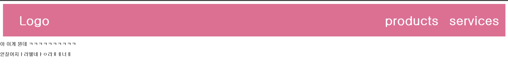
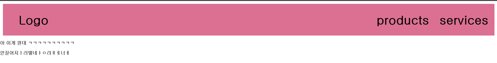

# CSS 스타일 덮어씌우는 방법 (2025-05-24)
- 우리가 HTML 이나 CSS 업무를 담당하다 보면
- 남의 `CSS 파일을 유지보수`하거나 `다시 작성`하는 일을 맡기도 한다.
- 이럴 때는, 그냥 크롬 관리자 도구로 HTML 코드를 하나씩 검사해보면서, 어떤 클래스 스타일이 여기에 사용되었는지 등을 확인하고, 이를 CSS 파일로 들어가서 고치거나 수정하면 된다.
- 근데 만약, `우리가 원본 CSS 파일에 접근하지 못하는 경우`는 어떻게 할까?
## 1. CSS 파일을 하나 더 만들고, 똑같은 클래스 명을 작성한 후, 하단에 작성한다.
```html
<!DOCTYPE html>
<html>
<head>
    <meta charset="UTF-8">
    <meta name="viewport" content="width=device-width, initial-scale=1.0">
    <title>Document</title>
    <link href="CSS/17강.css" rel="stylesheet">
</head>
<body>
    <div class="flex-container">
        <div class="flex-item">
            <h1>Logo</h1>
        </div>
        <div class="flex-item" style="flex-grow : 1.5"></div>
        <div class="flex-item">
            <h1>products</h1>
        </div>
        <div class="flex-item">
            <h1>services</h1>
        </div>
    </div>

    <div class="container">
        <div></div>
    </div>

    <div>
        <p> 아 이게 뭔데 ㅋㅋㅋㅋㅋㅋㅋㅋㅋㅋ</p>
    얻질어지ㅏ러엫네ㅑㅇ랴ㅐㅔ너ㅔ    </div>
</body>
</html>
```
``` CSS
div, input, textarea {
    box-sizing : border-box;
}

body {
    margin: 0px;
    font-family : 'gulim'; 
}

.flex-item {
    width : 200px;;
    height : 100px;
    margin :5px;
    text-align : center;
    color : white;
    font-weight : bold;
    font-size : 21px;
}

.flex-container {
    display : flex;
    justify-content : center;
    flex-direction : row;
    background-color : palevioletred;
    margin: 10px;
}

```
<br>
- 예전에 제작했던, 간단한 레이아웃을 가져왔다.
- 우리가 여기서 CSS 파일을 `접근할 수 없다`고 가정해 보겠다.
- 이럴 때는, `새로운 CSS파일`을 만들어서, `같은 이름의 클래스를 제작`한 후, `새로운 CSS 파일`을, 원래 CSS 파일 `아래에 위치`하면 된다.
```CSS
/* 17-1강.css */
.flex-item {
    color : black;
}
```
- 위 코드는, `새로운 CSS 파일`은 `17-1강.css` 파일이다.
- 이 파일을
```html
<head>
    <meta charset="UTF-8">
    <meta name="viewport" content="width=device-width, initial-scale=1.0">
    <title>Document</title>
    <link href="CSS/17강.css" rel="stylesheet">
    <link href="CSS/17-1강.css" rel="stylesheet">
</head>
```
- 우리의 html 파일 내부에서, `<head>` 속, 원래 CSS 파일보다 아래에다가 `link`를 걸어 놓는다.<br>

<br>
- `새로운 CSS 파일`인, `17-1강.css` 파일에 작성된 `color : black;` 코드가 `적용`된 것을 볼 수 있다.
- 같은 클래스명이 있을 때, html과 CSS 파일은, 하단에 작성된 코드를 우선적으로 적용한다.
- 우리가 예전에 `반응형 레이아웃`을 만든다고 사용한 `@media` 코드가 생각나나?
- 이때, `@media` 가 `CSS 파일 맨 하단`에 위치하는 이유도, 이와 동일한 원리이다.

## 2. 아니면 그냥 우선순위가 높은 스타일 서식을 사용해도 된다.
- `tag < class < id < style=""` `순서`로 `스타일 서식`이 `우선적`으로 `적용`된다.
```css
.flex-item {
    color : black;
    color : violet !important;
}
```
- 아니면, 스타일 뒤에 `!important` 를 사용하여, 이 스타일을 `최우선적으로 사용`해달라고 명시할 수도 있다.
- 근데, 이런 식으로 우선순위를 높여가면서 스타일을 조절하는 방식은, 계쏙 수정해나갈 방법을 막아버리기 때문에 `비추천`한다.
- 

## 3. Specificity (구체성 점수)를 높여가면서 작성해보는 방법도 있다.
``` CSS
/* 오리지널 CSS 파일인 17강.css 파일 */
div, input, textarea {
    box-sizing : border-box;
}

body {
    margin: 0px;
    font-family : 'gulim'; 
}

.flex-container .flex-item {
    color : black;
}

.flex-item {
    width : 200px;;
    height : 100px;
    margin :5px;
    text-align : center;
    color : white;
    font-weight : bold;
    font-size : 21px;
}

.flex-container {
    display : flex;
    justify-content : center;
    flex-direction : row;
    background-color : palevioletred;
    margin: 10px;
}
```
- 위 코드는, 원래 17강 레이아웃에서 작성하던 `17강.css` 파일이다.
- 위 코드를 실행하면 어떻게 레이아웃이 만들어질까?<br>

<br>
- flex-item 이 하단에 있는데, color : white가 적용되지 않고, `color : black` 이 적용되었다.
``` CSS
.flex-container .flex-item {
    color : black;
}
```
- 즉, 이 코드가 우선적으로 적용된 것이다.
- 이 코드는 `class 가 2개 사용`되었기 때문에, 아래 flex-item 이나 flex-container 보다 `우선순위가 높게 작용`한다.
- 즉, `태그를 여러개 붙여서 우선순위를 높이는 방식`으로도 `덮어씌우기를 가능하게 할 수 있다`.

## 4. 좋은 코드란?
### 1. 나중에 `수정/관리가 용이`하다면? 항상 좋은 코드이다.
### 2. `확장성`이 좋은 코드인가? `재활용`이 가능한가?
- 위 두가지 원칙을 생각하면서 코드를 짜보도록 하자.