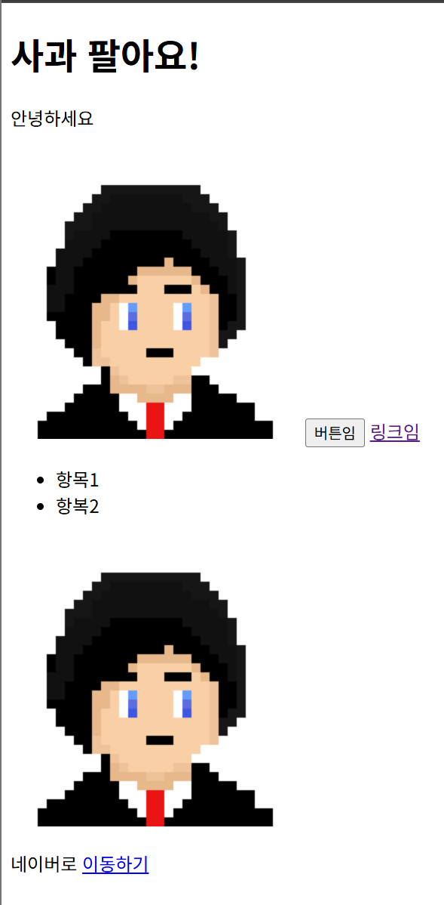

# HTML 기본 태그로 글 작성하기 (2025-05-09)
## 1. <태그> 개념 이해하기
- HTML 내부에서 글을 작성할 때는 <태그>로 작성한다.
- 본문에 글을 작성할 때는 다음과 같이 작성한다.
```html 
<p>안녕하세요</p>
```
- p는 paragraph의 약자이다.
- 시작하는 부분은 \<p>, 끝나는 부분은 \</p>를 작성한다.
- 일반 글을 작성할 때는 p 태그 사이에 작성해야 한다.
---
- 제목을 작성할 때는 다음과 같이 작성한다.
```html
<h1>사과 팔아요</h1>
```
- \<h1>는  heading의 약자이며, 제목을 표현할 때 사용한다.
- h뒤에 숫자는 1부터 6까지 사용한다.
- 작성해보면 실제로 더 큰 문자로 표현이 된다.

---
### <태그>를 사용해야 하는 이유가 뭔가요?
- 1강에서 배웠듯이, HTML은 마크업 언어이다.
- 마크업 언어는 자료의 구조를 표현하는 언어이다.
- 우리가 HTML 파일을 보았을 때, 파일 속 글자들의 용도와 목적을 바로 파악할 수 있어야 한다.
- <태그>를 사용하면 이 글이 어떤 목적인지 한번에 알 수 있다!
- <태그>를 잘 사용한 문서 = 웹 표준을 잘 지킨 문서이다.

## 2. 이미지 넣어보기
- 이미지를 삽입할 때는 다음과 같은 코드를 사용한다.
```html

```
- 특이하게 이 코드는 끝나는 \</p>와 같은 코드가 존재하지 않는다.
- html에 넣을 이미지를 아무거나 준비한후, 작업 폴더속에 이미지를 저장하자.
- 비주얼 스튜디오 코드 속 작업 폴더에 이미지 옮기면 된다.

- 이런식으로 작성하면 html 웹문서에 사진이 등장하게 된다.

## 3. 나머지 태그들 알아보기
### 3-1. 버튼 만들기
- 이번에는 웹사이트에서 사용될 버튼을 만들어보겠다.
```html
<button>버튼임</button>
```
- 이 코드를 작성하면, 웹사이트에서 버튼이 생성된다.
- ---
### 3-2. 링크 넣기
- 링크들을 넣고싶다면?
```html
<a href="이동할_링크">링크임</a>
```
---
### 3-3. 리스트 만들기
- 번호따라 정리할 수 있는 리스트를 만들고 싶다면?
```html
<ul>
    <li>항목1</li>
    <li>항복2</li>
</ul>
```
- \<ul> 태그와 \<li> 태그는 한 세트로 생각하면 된다.
- \<ul> == unordered list
- \<li> == list item
- 여기서 알 수 있는 점은, 태그 안에 태그를 넣을 수 있다는 사실을 알 수 있다!
- 자동으로 항목 앞에 번호를 매기고 싶다면은 \<ol> 태그를 사용한다.
```html
<ol>
    <li>항목1</li>
    <li>항목2</li>
</ol>
```
## 4. 배운점 정리하기
1. 웹페이즈를 제작할 때는 모든 내부 요소들을 태그를 사용한다.
2. 태그 속에 속성을 사용할 수 있음.
3. 태그 속에 태그를 사용할 수도 있음.

## 5. 이미지를 클릭하면 링크를 타고 넘어가게 만들어보기
```html
<a href="https://google.com">
    
</a>
```
- 간단하게 \<a> 태그 사이에 \ 태그를 작성하면 된다.

## 6. 오늘 배운 전체 코드와 결과
```html
<!DOCTYPE html>
<html>
    <head>
        <meta charset="UTF-8">
        <title>Document</title>
    </head>
    <body>
        <h1>사과 팔아요!</h1>
        <p>안녕하세요</p>
        
        <button>버튼임</button>
        <a href="https://google.com">링크임</a>
        <ul>
            <li>항목1</li>
            <li>항복2</li>
        </ul>
        <a href="https://google.com"></a>
        <p>네이버로 
            <a href="https://naver.com">이동하기</a>
        </p>
    <body>
</html>
```
