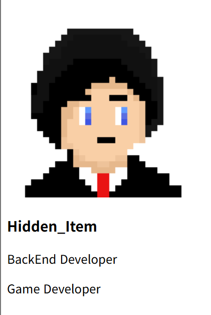
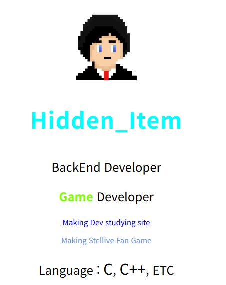

# HTML 기본적인 웹페이지 스타일링 (2025-05-09)
## 1. 간단한 프로필 페이지 만들어보기
```html
<!DOCTYPE html>
<html>
    <head>
        <meta charset="UTF-8">
        <title>Document</title>
    </head>
    <body>
        
        <h3>Hidden_Item</h3>
        <p>BackEnd Developer</p>
        <p>Game Developer</p>
    <body>
</html>
```
- 정말 간단히 코드를 프로필 페이지 코드를 구성하였다.

- 완성된 html을 보면 마음에 들지 않는다.
- 더 이쁘게 꾸며보자
  
## 2. 디자인을 추가하자
# 2-1. 프로필 사진 꾸미기
```html
<!--width는 가로 값--> <!--margin은 여백-->

```
- 거의 모든 html 태그 속에는 style= 을 사용할 수 있다.
- style= 을 사용하여 이미지의 모습을 변경하는 코드가 위의 코드이다.
- `style="width : 100px;` ==> 이미지의 가로 값을 100px로 설정한다.
- `margin-left: 10px"` ==> 이미지의 왼쪽 여백 값을 10px로 설정한다.
```
style="스타일명 : 스타일에_넣을_값; 스타일명 : 스타일에_넣을_값"
```
- 이때, 스타일 하나 지정이 끝나면 `;` 을 붙여준다.
---
- 이미지를 사이트에 완전히 가운데 정렬을 할러면 다음 코드를 입력한다.
```html

```
- 이렇게 작성하면, 사이트 창의 크기에 상관없이 항상 가운데에 정렬되서 출력된다.
## 3. 글자 스타일 추가하기
``` html
<h3 style="font-size: 30px; color:aqua; letter-spacing:1px;">Hidden_Item</h3>
```
- 이미지와 마찬가지로, 본문 태그에도 글자들에 대해 style 속성을 넣어서 디자인 할 수 있다.
- `font-size` == 글자 크기, px(픽셀) 등 단위들을 사용 가능함
- `font-family` == 글꼴
- `color` == 글자 색깔
- `letter-spacing` == 자간
---
```html
<p style="text-align:center;">BackEnd Developer</p>
```
- 위 코드처럼 작성하면, 글자가 사이트 창에 맞춰 가운데 정렬된다.
- `:` 뒤에 영어를 바꾸어서 왼쪽, 오른쪽 정렬도 가능하다.
---
```html
<p><span style="color:chartreuse">Game</span> Developer</p>
```
- \<span> 태그를 활용해서 글자의 일부만 스타일을 적용할 수 있다.
- `\<span>` == 아무 의미 없는 태그
---
```html
<p><strong style="color:chartreuse">Game</strong> Developer</p>
```
- strong 태그를 사용할 시, 글자가 굵어지는 효과를 만들 수 있다.
- `\<strong>` 태그를 사용하기 싫다면, `font-weight:100` 처럼 사용해도 된다.
- `font-weight`는 100~900까지 사용할 수 있다.
### 이런 스타일을 다 외워야되나요?
- 자주 사용하는 거는 외워두고, `모르는 거는 구글링`을 하면 된다.
- `걱정은 하지 말것!`
## 4. 과제 : 나만의 프로필 화면을 꾸며보라
```html
<!DOCTYPE html>
<html>
    <head>
        <meta charset="UTF-8">
        <title>Document</title>
    </head>
    <body>
        <!--width는 가로 값--> <!--margin은 여백-->
         
        <h3 style="font-size: 30px; color:aqua; letter-spacing:1px; text-align:center">Hidden_Item</h3>
        <p style="text-align:center;">BackEnd Developer</p>
        <p style="text-align:center"><strong style="color:chartreuse">Game</strong> Developer</p>
        <p style="color :blue; text-align:center; font-size: 10px">Making Dev studying site</p>
        <p style="color :cornflowerblue; text-align:center; font-size : 10px;">Making Stellive Fan Game</p>
        <p style="text-align:center">Language : <span style="color : black; font-size : 20px; text-align:center">C</span>, 
            <span style="text-align:center; font-size : 20px">C++</span>, 
            <span style="text-align:center">ETC</span></p>
        <p></p>
    <body>
</html>
```
