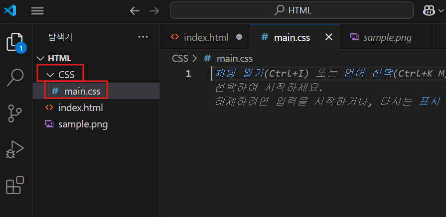

# HTML CSS 파일 만들고 첨부하기 (2025-05-10)
## 1. HTML의 스타일이 너무 많아지면?
- HTML 문서를 꾸미기 위해 style을 너무 작성하면 코드의 가독성이 매우 떨어진다.
```html
<!-- index.html 내부--> 
 
```
- 위와 같이 말이다.
- 그래서, HTML의 이런 스타일 구문을 다른 파일, 즉 CSS 파일로 뺄수 있다.

## 2. CSS 파일 만들어보기
- css 파일은 파일 명 맨 마지막에 `.css`로 끝나면 제작된다.
- 필자는 VS Code에서 CSS 폴더를 제작한 후, 거기다가 main.css 라는 파일을 제작했다.

- HTML 작업 폴더 속 CSS 작업 폴더 속 main.css 파일을 제작하였다.

## 3. HTML 파일에서 css 파일 링크하기
- HTML 파일에서 css 파일을 사용하기 위해서는, HTML 파일에서 CSS 파일을 link 해줘야 한다.
```html
<link href="CSS/main.css" rel="stylesheet" >
```
- 위 코드는 `<head>` 태그에서 `<title>` 태그 아래에 작성되면 된다.
- `<link href=` 이후에 CSS 파일의 링크를 넣어주면 된다.
- 필자는 CSS 작업 폴더 속에 제작하였기 때문에, `CSS/main.css` 로 파일의 링크를 작성하였다.
- 이후 `rel="stylesheet"` 속성도 작성한다.
- 
## 4. CSS 파일 작성하기
- HTML 코드 중, CSS 파일로 옮기고 싶은 스타일을 잘라내서 css 파일에 복사한다.
- 이후, 중괄호로 옮긴 스타일들을 묶는다.
- 이때, 스타일 코드들이 끝나고 모두 `;` 을 작성해야 한다.
- 중괄호 맨 앞에 `.` 을 찍고 원하는 이름을 작명해준다.
``` css
/* css 파일 내부 */
.profile {
width: 100px; 
display: block; 
margin-left : auto; 
margin-right : auto;
}
```
- 이 과정은, `HTML의 긴 스타일 코드`를 `.profile 이라는 이름으로 축약`한 것이다.
- 작성을 완료했으면, 이제 HTML 코드에 적용시켜 보자.
``` html
<!-- index.html 내부--> 

```
- 1 문단의 코드가 완전히 깔끔해진 것을 볼 수 있다.
- 동시에 작성된 HTML 웹 문서의 모습의 모습이 달라지지 않은 것을 알 수 있다. `(== 스타일이 적용됨.)`
- 이것은, css 파일에서 클래스를 생성하고, 생성한 클래스를 html 코드에서 사용한 걸로 생각할 수 있다.

## 5. class 이외에 css 파일의 스타일 만들기
### 5-1. `p 태그`를 이용해서 `css` 파일의 스타일을 작상하기.
```css
/* css 파일 내부 */
p {
    text-align:center;
}
```
- 이런식으로 작성하면, 모든 `<p>` 태그의 스타일을 이렇게 정렬해 달라. 라는 의미를 가진다.
- HTML 파일 내부의 `<p>` 태그들의 스타일이 적용된다.
- 기본 스타일을 만들 때 유용하다.
---
### 5-2. `#` 기호를 이용하기
```css
/* main.css 파일 내부 */
#special {
    text-align:center;
}
```
- `css 파일`에서 이렇게 `#원하는_이름` 으로 작명하는 방법도 있다.
- `이후 HTML 파일`에서는 이렇게 작성하면 스타일이 적용된다.
``` html
<!-- index.html 내부--> 
<p id="special">BackEnd Developer</p>
```
- HTML 파일에서 css 파일 속 special이라 불리는 id를 찾아 적용해달라는 것이다.
- 사실 id는 스타일 적용시 에는 사용하지 않는다. 이런 방법이 있다는 것만 알자.
- `.class`를 이용해서 `css 파일 속 스타일 사용을 추천한다.`

## 6. CSS selector(선택자)
- 우리가 배운 앞의 내용들을 CSS selector라고 부른다.
``` css
/* main.css 파일 내부 */
.profile {      <- class selector 라고 한다.
width: 100px; 
display: block; 
margin-left : auto; 
margin-right : auto;
}

p {             <- tag selector 라고 한다.
    text-align:center;
}

#special {      <- id selector 라고 한다.
    text-align:center;
}
```
- 위의 선택자를 배운 이유는, CSS 파일 속 우선순위를 알기 위해서이다.
## 7. CSS 파일 속 우선순위
```html
<!-- index.html 파일 내부 -->
<p id="special" class="content"> ~~~ </p>
```
``` css
/* main.css 파일 내부 */
.content {
    color : red;
}

p {
    color : green;
}

#special {
    color : blue;
}
```
- 위의 상황 처럼, `html 코드에 스타일을 적용하던 중`에 `css 파일 속 스타일들이 겹칠수가 있다`.
- class 선택자는 빨강, 태그 선택자는 초록, id 선택자는 파랑 색깔을 입힐러고 함.
- 이때, css 파일 속 우선순위가 작동한다.
```
special -> 1등
class -> 2등
태그 -> 3등
```
- 위의 순서로 적용이 되서, `html` 코드 속 `~~~` 는 `파란색`을 가지게 된다.
- 만약, html 코드에 `style=` 코드가 있다면? 이게 `제일 먼저 적용`된다.

## 7. 오늘 배운 CSS 의 특징 정리하기
1. class는 항상 .을 찍어서 작명한다.
2. class는 중복되지 않게 작명해야 한다.
3. 여러 가지 방법이 있다. `(클래스 선택자, 태그 선택자, 아이디 선택자)`
4. 각 선택자 별로 `우선순위가 존재`한다.
5. `CSS는 스타일 보관 파일이다.`

### 오늘 배운 코드 정리
``` css
/* main.css 파일 내부 */
.profile {
width: 100px; 
display: block; 
margin-left : auto; 
margin-right : auto;
}

.Title {
    font-size: 30px; color:aqua;
    letter-spacing:1px;
    text-align:center;
}

#special {
    text-align:center;
}
```
``` html
<!-- index.html 파일 내부 -->
<!DOCTYPE html>
<html>
    <head>
        <meta charset="UTF-8">
        <title>Document</title>
        <link href="CSS/main.css" rel="stylesheet" >
    </head>
    <body>
        <!--width는 가로 값--> <!--margin은 여백-->
         
        <h3 class="Title">Hidden_Item</h3>
        <p id="special">BackEnd Developer</p>
        <p style="text-align:center"><strong style="color:chartreuse">Game</strong> Developer</p>
        <p style="color :blue; text-align:center; font-size: 10px">Making Dev studying site</p>
        <p style="color :cornflowerblue; text-align:center; font-size : 10px;">Making Stellive Fan Game</p>
        <p style="text-align:center">Language : <span style="color : black; font-size : 20px; text-align:center">C</span>, 
            <span style="text-align:center; font-size : 20px">C++</span>, 
            <span style="text-align:center">ETC</span></p>
        <p></p>
    <body>
</html>

```
