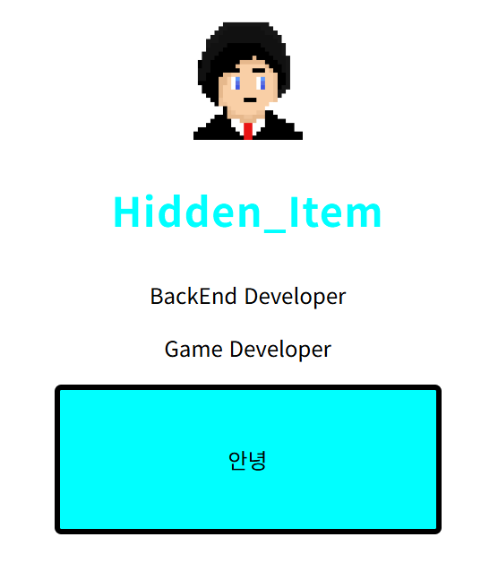
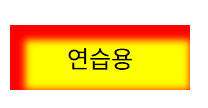
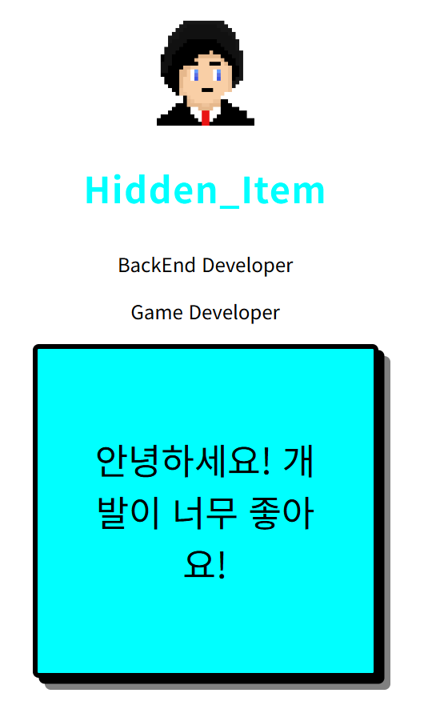

# 웹 디자인의 기초 : div를 이용해 네모 박스 만들기 (2025-05-10)
## 1. 네모 박스 만들기
- 네모 박스를 만들 때는 `<div>` 를 사용한다.
```html
<div></div>
```
- 물론 이렇게만 작성하면 html 파일 화면에 아무것도 나타나지 않는다.
- 스타일을 작성해보도록 하자.
``` html
<!-- index.html 파일 내부 -->
<div class="box"> Hello World! </div>
```
- 이제 css 파일 내부에 box 클래스를 제작하자.
``` css
/* main.css 파일 내부 */
.box {
    width : 200px; /* 폭 지정 */
    background-color: aqua; /* 배경 색깔 */
    padding : 40px; /* 안쪽 여백 지정(방향 지정 가능) */
    border : 4px solid black; /* 테두리 : 두께, 종류, 색깔 설정 가능 */
    border-radius:5px; /* 테두리 둥글게 */

    /* 박스 가운데 정렬 */
    display: block; /*생략 가능 <div>박스는 이걸 기본으로 가짐*/
    margin-left : auto; 
    margin-right : auto;

    text-align:center; /* 글자 가운데 정렬 */

    font-size : 30px; /* 박스 내부 글자 조절 */
}
```
- css 파일 내부 class에 `font-size` 로 스타일을 조절해도, 정상적으로 스타일이 적용된다.
- 즉, 부모 태그인 `<div>` 한테 스타일을 줘도, css 파일은 `inherit` 기능을 제공하기 때문이다.
- 이후 html 파일 화면을 봐보자.

- 박스가 제작되었다.
- 이런 스타일들은 다 구글에서 찾을 수 있으니 구글링을 잘해보자.

## 2. 박스 내부 글자 적기
- <div> 에 들어가는 글자를 작성할 때도 그냥 작성하면 안된다.
``` html
<!-- index.html 파일 내부 -->
<div class="box"> Hello World! </div>
```
- 이렇게 작성하면 안된다는 것이다. 업다운 언어에 맞춘 목적을 알려줘야 한다.
``` html
<!-- index.html 파일 내부 -->
<div class="box"> 
    <p>안녕하세요! 개발이 너무 좋아요!</p>
</div>
```
- 정상적으로 작성되었다.

## 3. inherit(상속)에 대해서 알아보자
- font-size와 같은 특별한 스타일들은 부모 클래스한테 적용될 시, 자식 클래스한테 자동으로 속성이 상속된다.
- 즉, 앞선 예시에서 box 클래스 내부 font-size가 이 예시가 된다.
- `font-size`, `font-family`, `color` 가 이 기능을 제공한다.
- 한 번에 스타일을 적용할 수 있어, 클래스를 막 사용하지 않을 수 있게 도와준다.

## 4. 박스에 그림자 추가하기
- box-shadow 스타일을 css 파일에 추가하면 된다.
``` css
box-shadow : 5px 5px 5px 5px red inset; /* 박스 그림자 생성 */
```
- 차례대로 설명해보자면.
1. `첫 번째 5px` == 그림자를 오른쪽으로 5px 만큼 생성(음수면 왼쪽으로 생성됨)
2. `두 번째 5px` == 그림자를 아래쪽으로 5px 만큼 생성(음수면 위쪽으로 생성됨)
3. `세 번째 5px` == 숫자가 커질 수록 그림자가 블러 처리되어 흐려짐
4. `네 번째 5px` == 숫자가 커질 수록 그림자의 크기가 커짐
5. `red` == 그림자의 색깔
6. `inset` == inset 키워드 사용 시, 그림자의 요소가 바깥이 아닌 안쪽에 생긴다.
- 저 코드를 실행시켜보면

- 다음 그림 처럼 박스가 생성된다. (html 파일 내부에서 박스 만드는 코드는 생략하겠다. 2단 참고)
---
- 그림자를 여러개 생성할 수 있다.
- 각 그림자를 `,` 를 사용해 구분하면 된다.
``` css
box-shadow : 5px 5px black, 10px 10px gray;
```
- 이러면 그림자가 두 개 생긴다. 확인본은 아래 5단을 참고하라.

## 5. 오늘 배운 코드 완성본
``` css
/* main.css 파일 내부 */
.box {
    width : 200px; /* 폭 지정 */
    background-color: aqua; /* 배경 색깔 */
    padding : 40px; /* 안쪽 여백 지정(방향 지정 가능) */
    border : 4px solid black; /* 테두리 : 두께, 종류, 색깔 설정 가능 */
    border-radius:5px; /* 테두리 둥글게 */

    /* 박스 가운데 정렬 */
    display: block; /*생략 가능 <div>박스는 이걸 기본으로 가짐*/
    margin-left : auto; 
    margin-right : auto;

    text-align:center; /* 글자 가운데 정렬 */

    font-size : 30px; /* 박스 내부 글자 조절 */

    box-shadow : 5px 5px black, 10px 10px gray; /* 박스 그림자 생성 */
} 
```
``` html
<!-- index.html 파일 내부 -->
<!DOCTYPE html>
<html>
    <head>
        <meta charset="UTF-8">
        <title>Document</title>
        <link href="CSS/main.css" rel="stylesheet" >
    </head>
    <body>
         
        <h3 class="Title">Hidden_Item</h3>
        <p class="content">BackEnd Developer</p>
        <p class="content">Game Developer</p>
        <div class="box"> 
            <p>안녕하세요! 개발이 너무 좋아요!</p>
        </div>
    <body>
</html>
```

