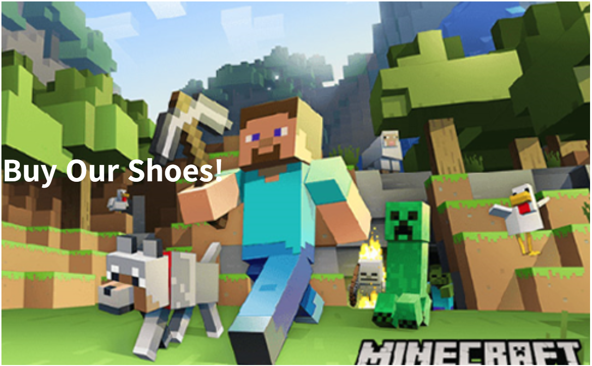
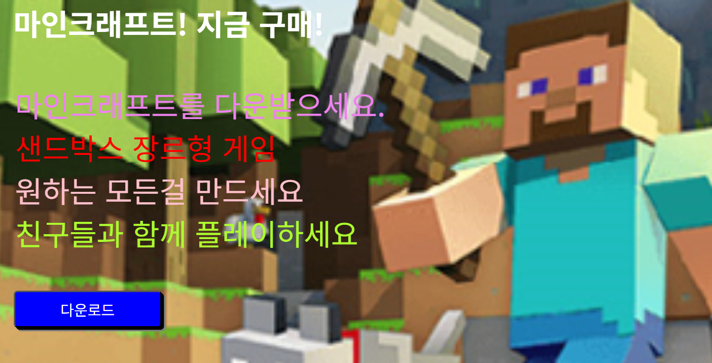

# 배경 이쁘게 넣기 스킬들 & margin collapse (2025-05-12)
## 1. margin-collapse
- 새로운 레이아웃들을 제작해보자.
- 새로운 html 파일을 제작하고 작성하였다.
``` html
<!-- layout2.html 파일 내부 -->
<!DOCTYPE html>
<html>
    <head>
        <meta charset="UTF-8">
        <title>Document</title>
        <link href="CSS/main2.css" rel="stylesheet">
    </head>
    <body>
        <div class="main-background">
            <h4 class="main-title">Buy Our Shoes!</h4>
        </div>
    </body>
</html>
```
``` css
/* main2.css 파일 내부 */
.main-background {
    width : 100%;
    height : 500px;
    
    /* 이미지 경로에 맞춰서 이미지를 넣어줌(../ = 상위 폴더로 이동하라) */ 
    background-image: url(../마크.png) /*, url(~)로 배경을 겹칠 수 있다.*/;
    
    /* 배경 이미지의 사이즈를 조정해라 (cover = 빈공간없이 div 박스를 배경으로 채워라) */
    /* cover 대신 contain( = div 박스의 빈공간이 생겨도 좋으니 이미지를 짜르지 마라)을 사용할 수 있다. */
    background-size : cover;
    
    /* 배경 이미지의 반복 여부를 설정하지 않음 */
    background-repeat : no-repeat;
    
    /* 배경 위치 조정 */
    background-position : center;
    
    /* 필터 주기 */
    /* filter : ~~~ */
    
    /* 스크롤 될시 배경 조정하기 */
    /* background-attachment : ~~~ */

}

.main-title {
    color : white;
    font-size : 40px;
    margin-top : 200px;
}
```
- 이렇게 작성하고 html 파일을 열어보면

- 내가 의도한 것 = 배경에 글자가 생기고, marin-top을 할 때 `글자만 아래로 내려가는 걸 원함`
- 다음과 같이 이미지 배경 위쪽에 공간이 생겨버린다. 
- 이는, `margin collapse` 현상으로, html 코드 상에서 버그를 확인할 수 있다.
``` html
    <body>
        <div class="main-background">
            <h4 class="main-title">Buy Our Shoes!</h4>
        </div>
    </body>
```
- 코드를 보면, `<div>`박스 안에 `<h4>` 박스가 만들어지는 걸 볼 수 가 있다.
- 이 둘의 박스의 위쪽 부분이 겹쳐져있기 때문에, margin이 합쳐지는 `margin collapse` 현상이 일어난다.
- 따라서, `<h4>`에서 marin-top을 조절하면, `<div>` 박스의 margin-top도 같이 조절되게 된다.
- 즉, `<> 태그`로 만든 `테이블들이 겹치게 되면`, `margin이 결합하게 된다`라고 이해하면 된다.
---
---
- 이 문제를 해결할러면 `padding` 같은 걸 사용해서, `부모 테이블에서 자식 테이블을 띄어놓으면` 된다.
``` css
/* main2.css 파일 내부 */
.main-background {
    padding: 1px;
}
```

- 의도대로 만들어진 것을 확인할 수 있다.

## 2. 나만의 레이아웃 만들어보기

``` html
<!DOCTYPE html>
<html>
    <head>
        <meta charset="UTF-8">
        <title>Document</title>
        <link href="CSS/main2.css" rel="stylesheet">
    </head>
    <body>
        <div class="main-background">
            <h4 class="main-title">마인크래프트! 지금 구매!</h4>
            <p1 class="main-text" style="color : violet">마인크래프트를 다운받으세요.<br></p1>
            <p1 class="main-text" style="color : red">샌드박스 장르형 게임<br></p1>
            <p1 class="main-text" style="color:pink">원하는 모든걸 만드세요<br></p1>
            <p1 class="main-text" style="color : greenyellow">친구들과 함께 플레이하세요<br></p1>
            <button class="main-button">다운로드</button>
        </div>
    </body>
</html>
```
``` css
.main-background {
    width : 100%;
    height : 500px;
    /* 이미지 경로에 맞춰서 이미지를 넣어줌(../ = 상위 폴더로 이동하라) */ 
    background-image: url(../마크.png) /*, url(~)로 배경을 겹칠 수 있다.*/;
    /* 배경 이미지의 사이즈를 조정해라 (cover = 빈공간없이 div 박스를 배경으로 채워라) */
    /* cover 대신 contain( = div 박스의 빈공간이 생겨도 좋으니 이미지를 짜르지 마라)을 사용할 수 있다. */
    background-size : cover;
    /* 배경 이미지의 반복 여부를 설정하지 않음 */
    background-repeat : no-repeat;
    /* 배경 위치 조정 */
    background-position : center;
    /* 필터 주기 */
    /* filter : ~~~ */
    /* 스크롤 될시 배경 조정하기 */
    /* background-attachment : ~~~ */
    padding: 1px;
}

.main-title {
    color : white;
    font-size : 40px;
    margin-top : 0px;
    margin-left : 20px;
}

.main-text {
    font-size : 40px;
    margin-left : 20px;
    color : black;
    padding : 2px;
}

.main-button {
    width:200px;
    height : 50px;
    border-radius : 5px;
    font-size : 20px;
    margin-top : 50px;
    margin-left : 20px;
    color : #fff;
    background-color : blue;
    box-shadow : 3px 3px black, 5px 5px gray;
}

.main-button:hover {

    color : purple;
}
```
- 지금 보니 엄청 짜치게 만든거 같다.