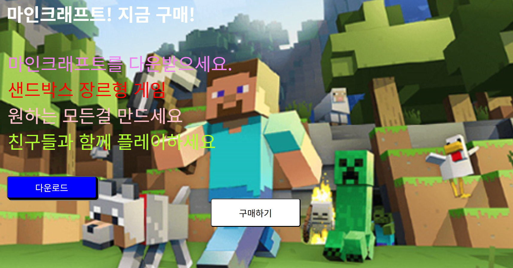
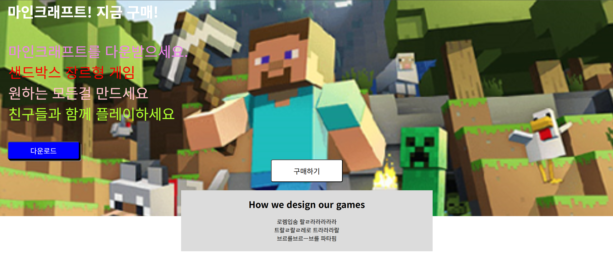

# position과 좌표 레이아웃 만들기 (2025-05-12)
## 1. Position 속성
- 8강에서 레이아웃을 제작하면서 margin-left를 사용해서 여백을 줌으로써 위치를 조절하였다.
- 이번에는 position을 가지고 위치를 조절해보겠다.
```css
/* css 파일 내부 */
.main2-button {
    padding : 15px;
    font-size : 20px;
    background:white;
    border-radius : 5px;

    /* 기준점을 잡아주는 역할을 함 + 공중에 띄어버림 */
    position: absolute;
    left : 0;
    right : 0;
    margin-left : auto;
    margin-right : auto;
    width : 200px;
}
```
- 새롭게 만드는 버튼의 클래스이다.
- 여기서 position 부분만 살펴보자.
```css
/* css 파일 내부 */
.main2-button {
    position: absolute;
    left : 0;
    right : 0;
    margin-left : auto;
    margin-right : auto;
    width : 200px;
}
```
- margin 서식 위에 position과 left, right가 있는걸 볼 수 있다.
- `left, right, top, bottom`을 사용하면 이 요소의 상하좌우 위치를 `여백 없이 변경`할 수 있다.
- 즉, 여백을 추가하지 않고 위치를 변경하는 것이다.`(붕 띄어서 이동시킴)`
---
---
- 이때, 좌표속성(left, right 등등)을 사용하기 전, position을 통해서 기준점을 잡아줘야 한다.
- 기준점을 기준으로 왼쪽에서 몇 이동(left :), 위에서 몇 이동(top :) 같은 기능을 사용할 수 있다.
``` css
.클래스_이름 {
  position : static; /* 기준이 없다. (좌표적용 불가) */
  position : relative; /* 요소의 원래 위치를 기준점으로 만듬 */
  position : absolute; /* 요소의 부모를 기준점으로 만듬 */
  position : fixed; /* 기준점을 현재 화면(브라우저 창)으로 만듬 (viewport) */
}
```
- 다음과 같이 `기준점`을 설정할 수 있다.
- 위 코드를 사용하여 만든 새로운 버튼은 아래 사진과 같다.

- 맨 아래 하얀색 배경의 버튼이 새롭게 만들어진 버튼이다.

## 2. 겹치는 박스 만들어보기
- main-background 박스를 부모로 삼아 position:absolute를 사용해서 제작하였다.
``` html
<!-- html 파일 내부 -->
    <body style="margin : 0px;">
        <div class="main-background">
            <!-- 중간 내용 생략 8강 참고 -->
            <div class="main2-background">
                <div class="main2-title">How we design our games</div>
                <div class="main2-text">
                    로렘입숨 랄ㄹ라라라라라<br>
                    트랄ㄹ랄ㄹ레로 트라라라랄<br>
                    브르를브르ㅡ브를 파타핌<br>
                </div>
            </div> 
        </div>
    </body>
```
```css
/* css 파일 내부 */
.main-background {
    width : 100%;
    height : 600px;
    background-image: url(../마크.png);
    background-size : cover;
    background-repeat : no-repeat;
    background-position : center;
    padding: 1px;
    position:relative;
}

/* (중간 내용 생략 8강 참고) */

.main2-background {
    position:absolute;
    left : 0;
    right : 0;
    margin-left : auto;
    margin-right : auto;
    top : 530px;
    width : 700px;
    height : 170px;
    background-color : gainsboro;
}

.main2-title {
    width : 700px;
    height : 35px;
    padding-top : 20px;
    text-align : center;
    font-size : 25px;
    font-weight : bold;
}

.main2-text {
    width : 700px;
    height : 95px;
    padding-top : 20px;
    text-align : center;

}
```

- 아래 회색 박스가 마인크래프트 이미지 배경화면과 겹쳐서 보이는 걸 확인할 수 있다.