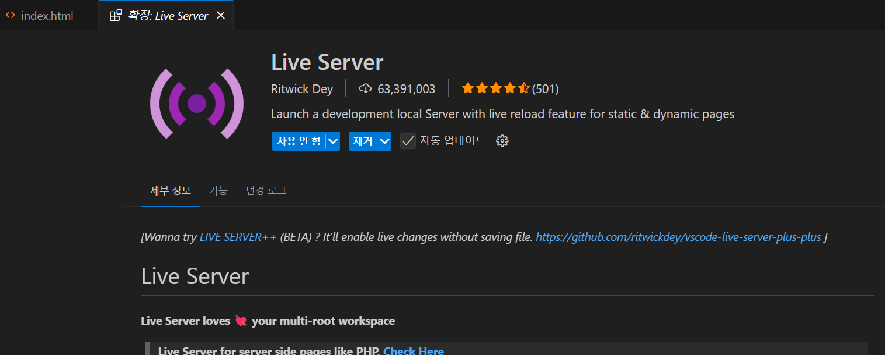

# HTML 기초 (2025-05-09)
## 1. HTML이란 무엇인가?
- HTML이란 웹페이지를 만들 때 사용하는 언어이다.

- HTML은 Hypertext Markup Language의 약자이다. 

- 여기서 Markup Language(마크업 언어)는 "자료의 구조를 표현하기 위한 언어를 의미한다."

- 우리가 웹페이지에 작성하는 글, 버튼, 검색창 그림과 같은 자료들이 어디에 위치해 있는지, 이런 정보들을 저장할 수 있는 언어가 HTML이다.

- 우리가 웹페이지를 만들 때는 코딩을 사용할 것이다.

## 2. 코드를 짜기위한 에디터 설치하기
- Brackets 에디터
- 필자는 Visual studio editor을 사용하겠다.
- 원하는 위치에 폴더를 미리 만들어두자. (D드라이브에 html 폴더 제작)
- 에디터 상에서 우리가 제작한 폴더를 열어 에디터 상에서 폴더를 열어둔다.
- 이 상태에서 코드를 작성해야 한다.


## 3. 첫 HTML 만들어보기
- 에디터에서 파일 만들기를 클릭한다.
- index.html 라는 이름의 파일을 제작한다.
- .html로 끝나면 모두 html 파일이라고 생각하자. == 웹사이트는 html로 끝난다.
- 웹의 메인 화면을 만들고 싶다면 index라는 이름의 파일 이름으로 작성한다.
- 그후, 파일 안에 아래 코드를 입력하자.
```html
<!Doctype html>
<html>
    <head>
        <meta charset="UTF-8">
        <title>Document</title>
    </head>
    <body>
        안녕하세요!
    </body>
</html>
```
- 이 코드가 모든 html에 들어가야할 기본 템플릿이라 생각하자.
- body와 /body 태그 사이에 원하는 문구를 입력하자.

## 4. 만든 HTML 띄어보기
- 2장에서 만든 폴더로 가보면 만들어진 index.html 파일이 있을 것이다.
- 이를 크롬 브라우저나 사용하는 브라우저로 열면, 웹 문서가 열릴것이다.


- VisualStudio Code 에디터를 사용하는 경우, Live Server라는 익스텐션을 설치하여 실시간으로 html 파일을 볼 수 있다.


- 다음 장 부터 HTML에 본격적으로 알아보자.
